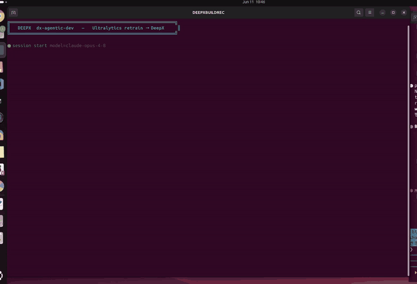
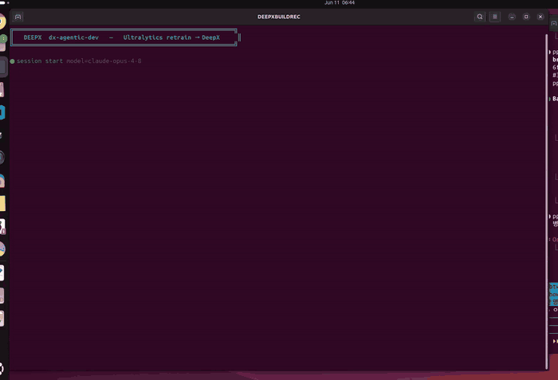

# DXNN - DEEPX NPU SDK (DX-AllSuite: DEEPX All Suite)

**DX-AllSuite**는 **DEEPX NPU** 상에서 AI inference 애플리케이션을 컴파일, 최적화, 시뮬레이션, 배포하는 전 과정을 간소화하도록 설계된 올인원 소프트웨어 플랫폼입니다. 모델 제작부터 실제 "Physical AI" 배포까지 모두 아우르는 완전한 toolchain을 통해 최적의 호환성과 강력한 하드웨어 성능을 보장합니다.

<div align="center">
  
  <p><strong>그림. DXNN SDK 전체 아키텍처 개요.</strong></p>
</div>

**주요 특징**

- **High Efficiency**: NPU 성능을 100% 끌어내는 자체 **DX-COM** compiler를 탑재했습니다. 고급 quantization(INT8 기반 Intelligent Quantization)을 활용해 정확도 손실을 최소화하면서 inference 속도를 극대화합니다.
- **Seamless Integration**: pre-processing, inference, post-processing 워크플로 전체를 잇는 지능형 video analytics pipeline을 구축합니다. **DX-Stream**(GStreamer 기반 custom plugin)을 사용하면 대규모 코드 수정 없이 복잡한 vision task를 배포할 수 있습니다.
- **Flexible Ecosystem**: **Python 및 C++ API**를 완전히 지원하며, 270개 이상의 최적화된 모델을 갖춘 **ModelZoo**를 제공합니다. Open-Source Physical AI Alliance의 리더로서, 널리 쓰이는 framework들에 대한 매끄러운 워크플로를 제공합니다.

<div align="center">
  
  <p><strong>그림. DXNN SDK 간략 아키텍처 개요.</strong></p>
</div>

## ✨ 자연어로 NPU 앱 만들기 — dx-agentic-dev (Beta)

<!-- dx-showcase:docs:cardgrid:start -->
> **프롬프트 하나 → 동작하는 DX-M1 NPU 앱.** 보일러플레이트도, 손으로 짠 파이프라인도 없이 — AI 코딩 에이전트가 DEEPX 지식 베이스를 end-to-end로 구동(brainstorm → plan → TDD → verify).

<table>
<tr>
 <td width="33%" align="center"><a href="dx-agentic-dev-showcase/squat-fitness-mini-game/README-ko.md"></a><br><b>스쿼트 카운팅 미니게임</b><br><sub>NPU 위 스쿼트 카운팅</sub></td>
 <td width="33%" align="center"><a href="dx-agentic-dev-showcase/stretching-coach-mini-game/README-ko.md"></a><br><b>스트레칭 coach 미니게임</b><br><sub>포즈 가이드 아케이드 coach</sub></td>
 <td width="33%" align="center"><a href="dx-agentic-dev-showcase/ultralytics-yolo-deepx-export/README-ko.md"></a><br><b>Ultralytics YOLO → DeepX Export</b><br><sub>한 줄 format=deepx</sub></td>
</tr>
<tr>
 <td width="33%" align="center"><a href="dx-agentic-dev-showcase/ultralytics-retrain-eval-deepx-export-wildlife/README-ko.md"></a><br><b>아프리카 야생동물 모니터링</b><br><sub>사파리 카메라 재학습</sub></td>
 <td width="33%" align="center"><a href="dx-agentic-dev-showcase/ultralytics-retrain-eval-deepx-export-ppe/README-ko.md"></a><br><b>건설 PPE 안전</b><br><sub>현장 안전 카메라 재학습</sub></td>
 <td width="33%" align="center"><a href="dx-agentic-dev-showcase/ultralytics-retrain-eval-deepx-export-braintumor/README-ko.md"></a><br><b>뇌종양 스크리닝</b><br><sub>의료 edge 재학습</sub></td>
</tr>
<tr>
 <td width="33%" align="center"><a href="dx-agentic-dev-showcase/ultralytics-retrain-eval-deepx-export-pills/README-ko.md"></a><br><b>의약품 알약 검사</b><br><sub>제약 카운팅 재학습</sub></td>
 <td></td>
 <td></td>
</tr>
</table>

**전체 showcase 목록 + 요약 →** [`dx-agentic-dev-showcase/README-ko.md`](./dx-agentic-dev-showcase/README-ko.md)  ·  **기능 설명 →** [Agentic Development 문서](./docs/source/00_Agentic_Development_kor.md)
<!-- dx-showcase:docs:cardgrid:end -->

## 시작하기

**DX-AllSuite**는 사용 목적에 따라 두 가지 환경을 제공합니다. 필요에 맞는 환경을 선택해 시작하세요.

### AI Model Compile 환경 (Host PC)

학습된 AI 모델을 DEEPX NPU 전용 binary로 변환·최적화하는 데 사용하는 환경입니다.

- **Arch**: x86_64
- **OS**: Ubuntu 24.04 / 22.04 / 20.04 (LTS), Fedora, Redhat, CentOS
- **Hardware**: x86_64 Host PC
- **Software**: Python 3.8~3.12, CUDA (시뮬레이션용, 선택)
- **Key Tasks**: AI 모델(`.onnx`) 컴파일, Quantization, `.dxnn` 생성
- **Action**: DX-Compiler Local Installation Guide [Link]

### AI Model Runtime 환경 (Target Device)

DEEPX NPU가 물리적으로 장착된 디바이스에서 inference를 수행하고 애플리케이션을 실행하는 환경입니다.

- **Arch**: x86_64, aarch64
- **OS**: Ubuntu 24.04 / 22.04 / 20.04 / 18.04 (LTS), Debian 13 / 12
- **Hardware**: Host PC / Target Board (DEEPX NPU 필요)
- **Software**: Python 3.8+
- **Key Tasks**: `.dxnn` 모델 실행, 실시간 데이터 inference, 리소스 관리
- **Action**: DX-Runtime Installation Guide [Link]

!!! warning "활성화 필요"
    설치 후 NPU Driver를 커널에 올바르게 로드하려면 시스템 재부팅이 필수입니다.
    ```Bash
    sudo reboot
    ```

## 지원 모델

DX-AllSuite는 우리 NPU에서 최고 성능을 내도록 최적화된, 업계 표준 AI 아키텍처를 폭넓게 지원합니다.

- **Image Classification**: AlexNet, ResNet/ResNeXt/WideResNet, MobileNet, EfficientNet (Lite/V2), ViT/DeiT/BEiT, MobileViT, FastViT, CasViT, RegNet, ShuffleNet, VGG 등.
- **Object Detection**: YOLO 계열 (YOLOv3–YOLOv11, YOLOX, YOLO26), SSD, EfficientDet, NanoDet, DamoYOLO.
- **Segmentation**: DeepLabV3/DeepLabV3+, SegFormer, BiSeNet, UNet, YOLACT, 그리고 YOLO 기반 segmentation 변형 (YOLOv5/YOLOv8/YOLO26).
- **Advanced Vision Tasks**: Face analysis (Detection, Recognition, Landmarks, Attributes), Human/Hand Pose Estimation, Low-Light Enhancement, Image Denoising, Super Resolution, Depth Estimation, Oriented Object Detection (OBB), Zero-Shot Instance Segmentation, Person Attributes.

!!! note "Pro Tip"
    모델을 직접 컴파일하는 대신, [**DEEPX ModelZoo**](https://developer.deepx.ai/modelzoo/)에서 **270개 이상의 최적화된 모델** 중 바로 사용 가능한 binary를 다운로드할 수 있습니다.

## 문서 내비게이션

처음 사용하는 분께는 다음 순서로 문서를 보시길 권장합니다.

- **★ [Agentic Development (Beta)](./docs/source/00_Agentic_Development_kor.md)**: AI coding agent(Claude Code, Cursor, GitHub Copilot, OpenCode, Codex CLI)로 자연어 프롬프트를 사용해 DEEPX 앱 만들기
- **Step 1. [DX-AllSuite Architecture Overview](./docs/source/01_DX-AllSuite_Architecture_Overview.md)**: SDK 개요, 모듈 설명, ModelZoo 사용법
- **Step 2. [Setting Up Environment](./docs/source/02_Setting_Up_Environment.md)**: Local/Docker 설치 상세 및 트러블슈팅
- **Step 3. [Running Your First NPU Model](./docs/source/03_Running_Your_First_NPU_Model.md)**: 단계별 hands-on 스크립트 실행
- **Step 4. [Checking Version Compatibility](./docs/source/04_Version_Compatibility.md)**: SDK, Driver, Firmware 의존성 매트릭스
- **Step 5. [FAQ Troubleshooting Guide](./docs/source/05_FAQ_Troubleshooting_Guide.md)**: 환경 충돌 및 GUI 세션(X11) 오류 해결책

## 지원

DEEPX 기술 지원팀이 매끄러운 AI 솔루션 구축을 돕습니다.

- **DEEPX Developer Portal**: [https://developer.deepx.ai](https://developer.deepx.ai) (최신 문서 및 SDK 릴리스 노트)
- **Technical Support**: [tech-support@deepx.ai](mailto:tech-support@deepx.ai) (커스텀 모델 배포 및 하드웨어 통합 상담)

Copyright © DEEPX. All rights reserved.

---
