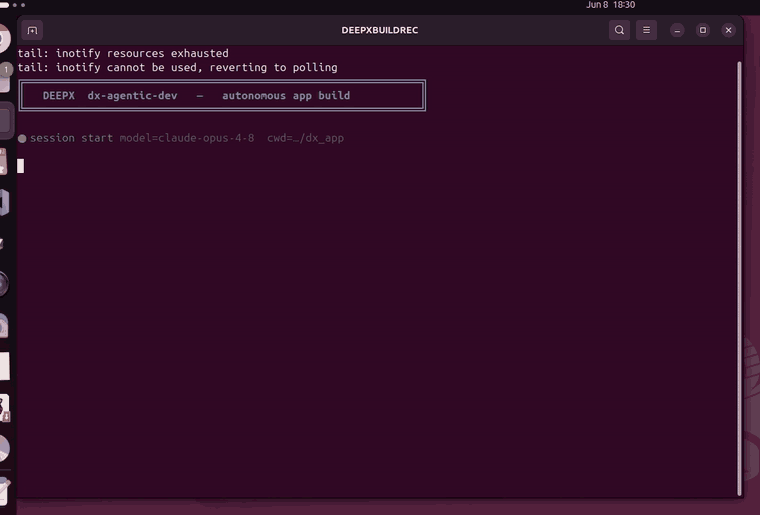
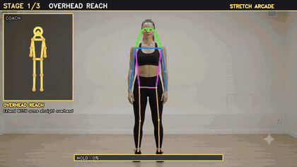
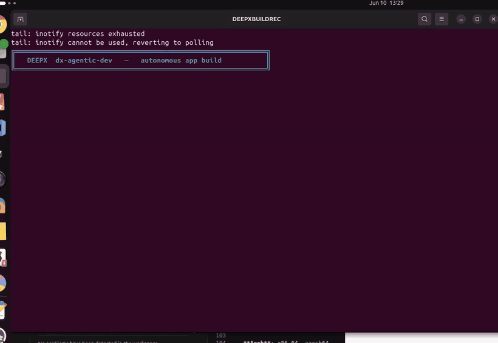
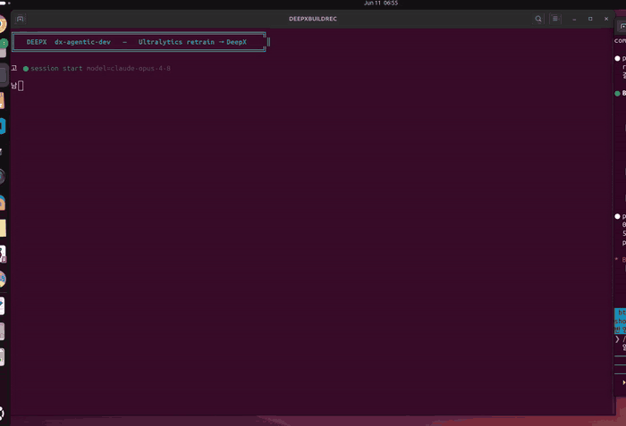
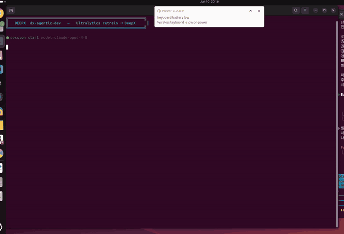
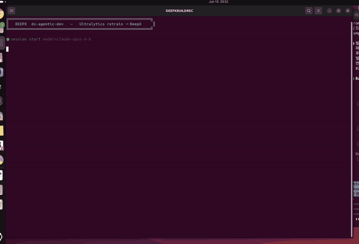

# DXNN - DEEPX NPU SDK (DX-AllSuite: DEEPX All Suite)

**DX-AllSuite**는 **DEEPX NPU** 상에서 AI inference 애플리케이션을 컴파일, 최적화, 시뮬레이션, 배포하는 전 과정을 간소화하도록 설계된 올인원 소프트웨어 플랫폼입니다. 모델 제작부터 실제 "Physical AI" 배포까지 모두 아우르는 완전한 toolchain을 통해 최적의 호환성과 강력한 하드웨어 성능을 보장합니다.

<div align="center">
  
  <p><strong>그림. DXNN SDK 전체 아키텍처 개요.</strong></p>
</div>

**주요 특징**

- **High Efficiency**: NPU 성능을 100% 끌어내는 자체 **DX-COM** compiler를 탑재했습니다. 고급 quantization(INT8 기반 Intelligent Quantization)을 활용해 정확도 손실을 최소화하면서 inference 속도를 극대화합니다.
- **Seamless Integration**: pre-processing, inference, post-processing 워크플로 전체를 잇는 지능형 video analytics pipeline을 구축합니다. **DX-Stream**(GStreamer 기반 custom plugin)을 사용하면 대규모 코드 수정 없이 복잡한 vision task를 배포할 수 있습니다.
- **Flexible Ecosystem**: **Python 및 C++ API**를 완전히 지원하며, 270개 이상의 최적화된 모델을 갖춘 **ModelZoo**를 제공합니다. Open-Source Physical AI Alliance의 리더로서, 널리 쓰이는 framework들에 대한 매끄러운 워크플로를 제공합니다.

<div align="center">
  
  <p><strong>그림. DXNN SDK 간략 아키텍처 개요.</strong></p>
</div>

## ✨ 자연어로 앱 만들기 — dx-agentic-dev (Beta)

> **단 20분, 약 $10의 비용으로, 자연어를 통해 DEEPX NPU용 피트니스 게임을 완전 자율형으로
> 개발할 수 있습니다.** 원하는 앱을 평범한 자연어로 설명하면, AI coding agent가 DEEPX SDK
> 위에서 end-to-end로 만들어 줍니다.

### Showcase 1: 스쿼트 카운팅 피트니스 미니게임(DEEPX SQUAT CHALLENGE)

<div align="center">
<table>
<tr>
<td align="center"><br><sub><b>dx-agentic-dev가 앱을 빌드하는 모습 (timelapse)</b></sub></td>
<td align="center"><br><sub><b>생성된 앱이 NPU에서 실행되는 모습</b></sub></td>
</tr>
</table>
</div>

**▶️ 직접 실행해보기** — 생성된 앱이
**[`dx-agentic-dev-showcase/squat-fitness-mini-game/`](./dx-agentic-dev-showcase/squat-fitness-mini-game/)**
에 그대로 들어 있습니다.
[README](./dx-agentic-dev-showcase/squat-fitness-mini-game/README.md)를 읽고 실행하세요.

**🔍 agent가 어떻게 만들었는지 확인하기** — agent가 harness instruction을 어떻게 따르고
프로젝트 skill/agent를 어떻게 활용했는지 볼 수 있도록 전체
[Claude Code 세션](./dx-agentic-dev-showcase/squat-fitness-mini-game/claude-code-session.md)이
포함되어 있습니다.

### Showcase 2: 아케이드 스트레칭 coach 미니게임(STRETCH ARCADE)

<div align="center">
<table>
<tr>
<td align="center"><br><sub><b>dx-agentic-dev가 스트레칭 게임을 빌드하는 모습 (timelapse)</b></sub></td>
<td align="center"><br><sub><b>생성된 앱이 NPU에서 실행 (coach 아바타 + 3단계)</b></sub></td>
</tr>
</table>
</div>

**▶️ 직접 실행해보기** — 생성된 앱이
**[`dx-agentic-dev-showcase/stretching-coach-mini-game/`](./dx-agentic-dev-showcase/stretching-coach-mini-game/)**
에 들어 있습니다
([README](./dx-agentic-dev-showcase/stretching-coach-mini-game/README.md)).

### Showcase 3: Ultralytics YOLO → DeepX Export (one-shot `format=deepx`)

<div align="center">
<br><sub><b>dx-agentic-dev가 이 showcase를 만드는 과정 (timelapse) — export → dx_com compile → NPU inference → verify</b></sub>
</div>

DEEPX × **Ultralytics** 기술 통합: Ultralytics YOLO `.pt`를 **명령 한 번**으로 배포
가능한 DeepX NPU 모델로 변환합니다 —

```bash
yolo export model=yolo26n.pt format=deepx   # → yolo26n_deepx_model/ (.dxnn + config + metadata)
```

*"내 YOLO26n 모델을 DeepX로 export하고 inference 실행해줘"* 프롬프트 하나로, 에이전트는
knowledge base를 통해
[`ultralytics-deepx-export`](./dx-compiler/.deepx/toolsets/ultralytics-deepx-export.md)
toolset으로 라우팅되어 export + 배포를 수행합니다 — 수작업 파이프라인 없이.

**▶️ 직접 실행해보기** —
**[`dx-agentic-dev-showcase/ultralytics-yolo-deepx-export/`](./dx-agentic-dev-showcase/ultralytics-yolo-deepx-export/)**
에 들어 있습니다
([README](./dx-agentic-dev-showcase/ultralytics-yolo-deepx-export/README-ko.md)).

### Showcase 4: Ultralytics 재학습 → DeepX NPU (도메인 최적화)

<!-- dx-showcase:ultralytics-retrain-deepx:gif:start -->
<div align="center">
<br><sub><b>dx-agentic-dev가 이 showcase를 만드는 과정 — 재학습 → DeepX → NPU FPS/mAP</b></sub>
</div>
<!-- dx-showcase:ultralytics-retrain-deepx:gif:end -->


DEEPX × **Ultralytics** Option 1(로컬 Python 패키지): `yolo26n`을 도메인 데이터셋으로
재학습하고 DeepX(`format=deepx`)로 export해 DX-M1 NPU에서 측정 — stock COCO 모델
**mAP50-95 0.001 → 재학습 0.791**, **+41% FPS**(57 → 80.6); INT8가 fp32 정확도 유지.
*이 showcase 자체가 `dx-agentic-showcase-build` skill + `dx-showcase-gen` 도구로 제작·녹화됨.*

**▶️ 직접 실행해보기** —
**[`dx-agentic-dev-showcase/ultralytics-retrain-deepx/`](./dx-agentic-dev-showcase/ultralytics-retrain-deepx/)**
에 들어 있습니다
([README](./dx-agentic-dev-showcase/ultralytics-retrain-deepx/README-ko.md)).

### Showcase 5: Ultralytics PPE 탐지 → DeepX NPU (건설 안전)

<!-- dx-showcase:ultralytics-ppe-deepx:gif:start -->
<div align="center">
<br><sub><b>dx-agentic-dev가 이 showcase를 만드는 과정 — 재학습 → DeepX → 4-way 평가</b></sub>
</div>
<!-- dx-showcase:ultralytics-ppe-deepx:gif:end -->


**건설 현장 안전 카메라**용 도메인 최적화: `construction-ppe`로 `yolo26n` 재학습 후
DX-M1 NPU 배포 — stock COCO **mAP50-95 0.0001 → 재학습 0.256**(INT8 NPU), **+32% FPS**
(58 → 76); base/재학습 × fp32-GPU / INT8-NPU **4-way 평가**.

**▶️ 직접 실행해보기** — **[`dx-agentic-dev-showcase/ultralytics-ppe-deepx/`](./dx-agentic-dev-showcase/ultralytics-ppe-deepx/)**
([README](./dx-agentic-dev-showcase/ultralytics-ppe-deepx/README-ko.md)).

### Showcase 6: Ultralytics 뇌종양 스크리닝 → DeepX NPU (의료 edge)

<!-- dx-showcase:ultralytics-braintumor-deepx:gif:start -->
<div align="center">
<br><sub><b>dx-agentic-dev가 이 showcase를 만드는 과정 — 재학습 → DeepX → 4-way 평가</b></sub>
</div>
<!-- dx-showcase:ultralytics-braintumor-deepx:gif:end -->


**의료 edge 디바이스**용 도메인 최적화: `brain-tumor`(MRI/CT)로 `yolo26n` 재학습 후 DX-M1
NPU 배포 — stock COCO **mAP50-95 ~0.0005 → 재학습 0.40**(INT8 NPU), **+34% FPS**
(58 → 78); base/재학습 × fp32/INT8 **4-way 평가**.

**▶️ 직접 실행해보기** — **[`dx-agentic-dev-showcase/ultralytics-braintumor-deepx/`](./dx-agentic-dev-showcase/ultralytics-braintumor-deepx/)**
([README](./dx-agentic-dev-showcase/ultralytics-braintumor-deepx/README-ko.md)).

➡️ **[Agentic Development (Beta) 시작하기](./docs/source/00_Agentic_Development_kor.md)**

## 시작하기

**DX-AllSuite**는 사용 목적에 따라 두 가지 환경을 제공합니다. 필요에 맞는 환경을 선택해 시작하세요.

### AI Model Compile 환경 (Host PC)

학습된 AI 모델을 DEEPX NPU 전용 binary로 변환·최적화하는 데 사용하는 환경입니다.

- **Arch**: x86_64
- **OS**: Ubuntu 24.04 / 22.04 / 20.04 (LTS), Fedora, Redhat, CentOS
- **Hardware**: x86_64 Host PC
- **Software**: Python 3.8~3.12, CUDA (시뮬레이션용, 선택)
- **Key Tasks**: AI 모델(`.onnx`) 컴파일, Quantization, `.dxnn` 생성
- **Action**: DX-Compiler Local Installation Guide [Link]

### AI Model Runtime 환경 (Target Device)

DEEPX NPU가 물리적으로 장착된 디바이스에서 inference를 수행하고 애플리케이션을 실행하는 환경입니다.

- **Arch**: x86_64, aarch64
- **OS**: Ubuntu 24.04 / 22.04 / 20.04 / 18.04 (LTS), Debian 13 / 12
- **Hardware**: Host PC / Target Board (DEEPX NPU 필요)
- **Software**: Python 3.8+
- **Key Tasks**: `.dxnn` 모델 실행, 실시간 데이터 inference, 리소스 관리
- **Action**: DX-Runtime Installation Guide [Link]

!!! warning "활성화 필요"
    설치 후 NPU Driver를 커널에 올바르게 로드하려면 시스템 재부팅이 필수입니다.
    ```Bash
    sudo reboot
    ```

## 지원 모델

DX-AllSuite는 우리 NPU에서 최고 성능을 내도록 최적화된, 업계 표준 AI 아키텍처를 폭넓게 지원합니다.

- **Image Classification**: AlexNet, ResNet/ResNeXt/WideResNet, MobileNet, EfficientNet (Lite/V2), ViT/DeiT/BEiT, MobileViT, FastViT, CasViT, RegNet, ShuffleNet, VGG 등.
- **Object Detection**: YOLO 계열 (YOLOv3–YOLOv11, YOLOX, YOLO26), SSD, EfficientDet, NanoDet, DamoYOLO.
- **Segmentation**: DeepLabV3/DeepLabV3+, SegFormer, BiSeNet, UNet, YOLACT, 그리고 YOLO 기반 segmentation 변형 (YOLOv5/YOLOv8/YOLO26).
- **Advanced Vision Tasks**: Face analysis (Detection, Recognition, Landmarks, Attributes), Human/Hand Pose Estimation, Low-Light Enhancement, Image Denoising, Super Resolution, Depth Estimation, Oriented Object Detection (OBB), Zero-Shot Instance Segmentation, Person Attributes.

!!! note "Pro Tip"
    모델을 직접 컴파일하는 대신, [**DEEPX ModelZoo**](https://developer.deepx.ai/modelzoo/)에서 **270개 이상의 최적화된 모델** 중 바로 사용 가능한 binary를 다운로드할 수 있습니다.

## 문서 내비게이션

처음 사용하는 분께는 다음 순서로 문서를 보시길 권장합니다.

- **★ [Agentic Development (Beta)](./docs/source/00_Agentic_Development_kor.md)**: AI coding agent(Claude Code, Cursor, GitHub Copilot, OpenCode, Codex CLI)로 자연어 프롬프트를 사용해 DEEPX 앱 만들기
- **Step 1. [DX-AllSuite Architecture Overview](./docs/source/01_DX-AllSuite_Architecture_Overview.md)**: SDK 개요, 모듈 설명, ModelZoo 사용법
- **Step 2. [Setting Up Environment](./docs/source/02_Setting_Up_Environment.md)**: Local/Docker 설치 상세 및 트러블슈팅
- **Step 3. [Running Your First NPU Model](./docs/source/03_Running_Your_First_NPU_Model.md)**: 단계별 hands-on 스크립트 실행
- **Step 4. [Checking Version Compatibility](./docs/source/04_Version_Compatibility.md)**: SDK, Driver, Firmware 의존성 매트릭스
- **Step 5. [FAQ Troubleshooting Guide](./docs/source/05_FAQ_Troubleshooting_Guide.md)**: 환경 충돌 및 GUI 세션(X11) 오류 해결책

## 지원

DEEPX 기술 지원팀이 매끄러운 AI 솔루션 구축을 돕습니다.

- **DEEPX Developer Portal**: [https://developer.deepx.ai](https://developer.deepx.ai) (최신 문서 및 SDK 릴리스 노트)
- **Technical Support**: [tech-support@deepx.ai](mailto:tech-support@deepx.ai) (커스텀 모델 배포 및 하드웨어 통합 상담)

Copyright © DEEPX. All rights reserved.

---
