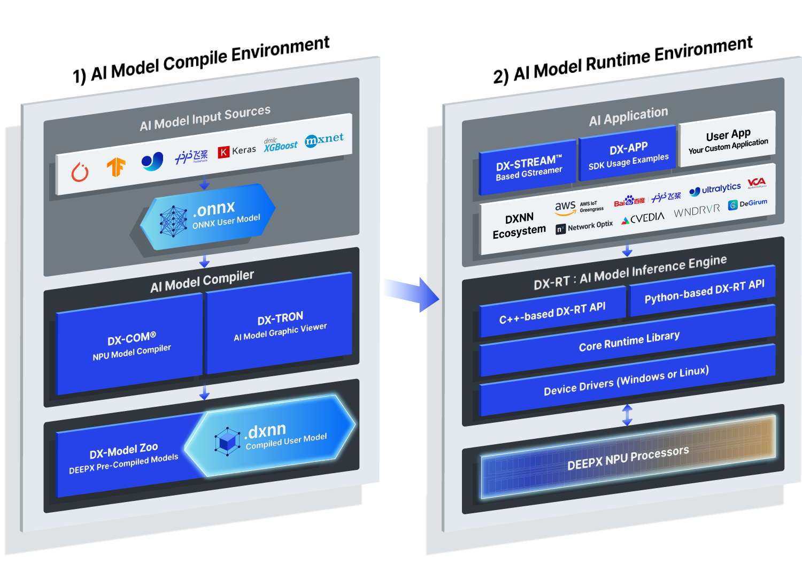
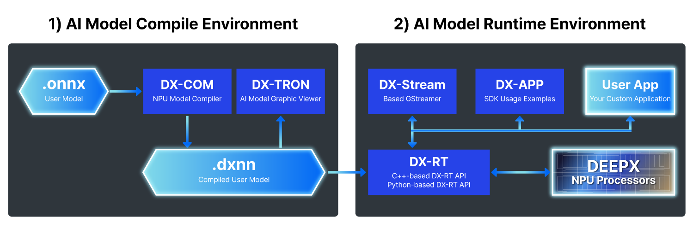

# DXNN - DEEPX NPU SDK (DX-AllSuite: DEEPX All Suite)

**DX-AllSuite** is an all-in-one software platform designed to streamline the entire process of compiling, optimizing, simulating, and deploying AI inference applications on **DEEPX NPUs**. It ensures optimal compatibility and powerful hardware performance through a complete toolchain that covers everything from model creation to real-world "Physical AI" deployment.  

<div align="center">
  
  <p><strong>Figure. DXNN SDK Full Architecture Overview.</strong></p>
</div>

**Key Features**  

- **High Efficiency**: Equipped with the proprietary **DX-COM** compiler that extracts 100% of NPU performance. It utilizes advanced quantization (Intelligent Quantization with INT8) to minimize accuracy loss while maximizing inference speed.  
- **Seamless Integration**: Build intelligent video analytics pipelines that bridge the entire pre-processing, inference, and post-processing workflow. Using **DX-Stream** (GStreamer-based custom plugins), you can deploy complex vision tasks without extensive code modifications.  
- **Flexible Ecosystem**: Fully supports **Python and C++ APIs** and offers a **ModelZoo** with over 270 optimized models. As a leader in the Open-Source Physical AI Alliance, we provide seamless workflows for popular frameworks.  

<div align="center">
  
  <p><strong>Figure. DXNN SDK Simple Architecture Overview.</strong></p>
</div>

## Getting Started

**DX-AllSuite** provides two environments depending on your intended use. Choose the environment that fits your needs to get started.

### AI Model Compile Environment (Host PC)  

This environment is used for converting and optimizing trained AI models into DEEPX NPU-specific binaries.  

- **Arch**: x86_64  
- **OS**: Ubuntu 24.04 / 22.04 / 20.04 (LTS), Fedora, Redhat, CentOS  
-	**Hardware**: x86_64 Host PC  
- **Software**: Python 3.8~3.12, CUDA (Optional for simulation)  
-	**Key Tasks**: AI model (`.onnx`) compilation, Quantization, `.dxnn` generation  
-	**Action**: DX-Compiler Local Installation Guide [Link]  

### AI Model Runtime Environment (Target Device)

This environment is for performing inference and running applications on devices physically equipped with DEEPX NPUs.  

-	**Arch**: x86_64, aarch64 
-	**OS**: Ubuntu 24.04 / 22.04 / 20.04 / 18.04 (LTS), Debian 13 / 12
-	**Hardware**: Host PC / Target Board (DEEPX NPU is required)
-	**Software**: Python 3.8+
-	**Key Tasks**: `.dxnn` model execution, real-time data inference, resource management
-	**Action**: DX-Runtime Installation Guide [Link]

!!! warning "Activation Required"  
    A system reboot is mandatory after installation to properly load the NPU Driver into the kernel.  
    ```Bash  
    sudo reboot  
    ```

## Supported Models

DX-AllSuite supports a vast array of industry-standard AI architectures, optimized for peak performance on our NPU.  

- **Image Classification**: AlexNet, ResNet/ResNeXt/WideResNet, MobileNet, EfficientNet (Lite/V2), ViT/DeiT/BEiT, MobileViT, FastViT, CasViT, RegNet, ShuffleNet, VGG, and more.  
- **Object Detection**: YOLO families (YOLOv3–YOLOv11, YOLOX, YOLO26), SSD, EfficientDet, NanoDet, DamoYOLO.  
- **Segmentation**: DeepLabV3/DeepLabV3+, SegFormer, BiSeNet, UNet, YOLACT, and YOLO-based segmentation variants (YOLOv5/YOLOv8/YOLO26).  
- **Advanced Vision Tasks**: Face analysis (Detection, Recognition, Landmarks, Attributes), Human/Hand Pose Estimation, Low-Light Enhancement, Image Denoising, Super Resolution, Depth Estimation, Oriented Object Detection (OBB), Zero-Shot Instance Segmentation, and Person Attributes.  

!!! note "Pro Tip"  
    Instead of compiling models yourself, you can download ready-to-use binaries from the [**DEEPX ModelZoo**](https://developer.deepx.ai/modelzoo/), which features **over 270 optimized models**.  


## Documentation Navigation

If you are a first-time user, we recommend following the documentation in this order.  

- **Step 1. [DX-AllSuite Architecture Overview](./docs/source/01_DX-AllSuite_Architecture_Overview.md)**: SDK overview, module descriptions, and ModelZoo usage  
- **Step 2. [Setting Up Environment](./docs/source/02_Setting_Up_Environment.md)**: Detailed Local/Docker installation and troubleshooting  
- **Step 3. [Running Your First NPU Model](./docs/source/03_Running_Your_First_NPU_Model.md)**: Step-by-step hands-on script execution  
- **Step 4. [Checking Version Compatibility](./docs/source/04_Version_Compatibility.md)**: SDK, Driver, and Firmware dependency matrix  
- **Step 5. [FAQ Troubleshooting Guide](./docs/source/05_FAQ_Troubleshooting_Guide.md)**: Solutions for environment conflicts and GUI session (X11) errors  

## Support

The DEEPX Technical Support Team is here to help you build smooth AI solutions.  

- **DEEPX Developer Portal**: [https://developer.deepx.ai](https://developer.deepx.ai) (Latest documentation and SDK release notes)  
- **Technical Support**: [tech-support@deepx.ai](mailto:tech-support@deepx.ai) (Consultation on custom model deployment and hardware integration)    

Copyright © DEEPX. All rights reserved.  

---
