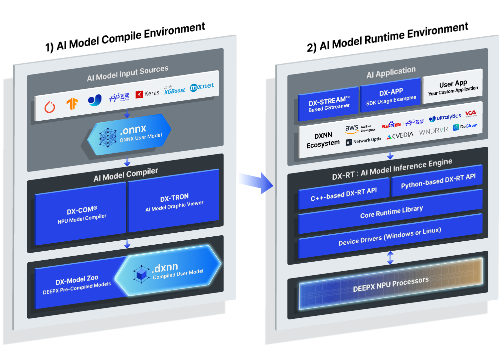
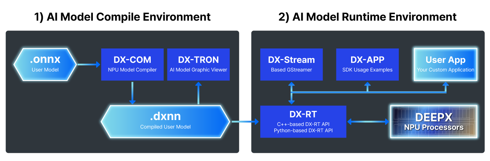
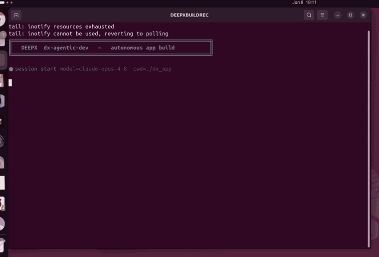
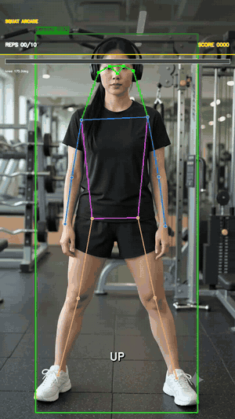

# DXNN - DEEPX NPU SDK (DX-AllSuite: DEEPX All Suite)

**DX-AllSuite** is an all-in-one software platform designed to streamline the entire process of compiling, optimizing, simulating, and deploying AI inference applications on **DEEPX NPUs**. It ensures optimal compatibility and powerful hardware performance through a complete toolchain that covers everything from model creation to real-world "Physical AI" deployment.  

<div align="center">
  
  <p><strong>Figure. DXNN SDK Full Architecture Overview.</strong></p>
</div>

**Key Features**  

- **High Efficiency**: Equipped with the proprietary **DX-COM** compiler that extracts 100% of NPU performance. It utilizes advanced quantization (Intelligent Quantization with INT8) to minimize accuracy loss while maximizing inference speed.  
- **Seamless Integration**: Build intelligent video analytics pipelines that bridge the entire pre-processing, inference, and post-processing workflow. Using **DX-Stream** (GStreamer-based custom plugins), you can deploy complex vision tasks without extensive code modifications.  
- **Flexible Ecosystem**: Fully supports **Python and C++ APIs** and offers a **ModelZoo** with over 270 optimized models. As a leader in the Open-Source Physical AI Alliance, we provide seamless workflows for popular frameworks.  

<div align="center">
  
  <p><strong>Figure. DXNN SDK Simple Architecture Overview.</strong></p>
</div>

## Getting Started

**DX-AllSuite** provides two environments depending on your intended use. Choose the environment that fits your needs to get started.

### AI Model Compile Environment (Host PC)  

This environment is used for converting and optimizing trained AI models into DEEPX NPU-specific binaries.  

- **Arch**: x86_64  
- **OS**: Ubuntu 24.04 / 22.04 / 20.04 (LTS), Fedora, Redhat, CentOS  
-	**Hardware**: x86_64 Host PC  
- **Software**: Python 3.8~3.12, CUDA (Optional for simulation)  
-	**Key Tasks**: AI model (`.onnx`) compilation, Quantization, `.dxnn` generation  
-	**Action**: DX-Compiler Local Installation Guide [Link]  

### AI Model Runtime Environment (Target Device)

This environment is for performing inference and running applications on devices physically equipped with DEEPX NPUs.  

-	**Arch**: x86_64, aarch64 
-	**OS**: Ubuntu 24.04 / 22.04 / 20.04 / 18.04 (LTS), Debian 13 / 12
-	**Hardware**: Host PC / Target Board (DEEPX NPU is required)
-	**Software**: Python 3.8+
-	**Key Tasks**: `.dxnn` model execution, real-time data inference, resource management
-	**Action**: DX-Runtime Installation Guide [Link]

!!! warning "Activation Required"  
    A system reboot is mandatory after installation to properly load the NPU Driver into the kernel.  
    ```Bash  
    sudo reboot  
    ```

## Supported Models

DX-AllSuite supports a vast array of industry-standard AI architectures, optimized for peak performance on our NPU.  

- **Image Classification**: AlexNet, ResNet/ResNeXt/WideResNet, MobileNet, EfficientNet (Lite/V2), ViT/DeiT/BEiT, MobileViT, FastViT, CasViT, RegNet, ShuffleNet, VGG, and more.  
- **Object Detection**: YOLO families (YOLOv3–YOLOv11, YOLOX, YOLO26), SSD, EfficientDet, NanoDet, DamoYOLO.  
- **Segmentation**: DeepLabV3/DeepLabV3+, SegFormer, BiSeNet, UNet, YOLACT, and YOLO-based segmentation variants (YOLOv5/YOLOv8/YOLO26).  
- **Advanced Vision Tasks**: Face analysis (Detection, Recognition, Landmarks, Attributes), Human/Hand Pose Estimation, Low-Light Enhancement, Image Denoising, Super Resolution, Depth Estimation, Oriented Object Detection (OBB), Zero-Shot Instance Segmentation, and Person Attributes.  

!!! note "Pro Tip"  
    Instead of compiling models yourself, you can download ready-to-use binaries from the [**DEEPX ModelZoo**](https://developer.deepx.ai/modelzoo/), which features **over 270 optimized models**.  


## ✨ Build Apps with Natural Language — dx-agentic-dev (Beta)

**New in DX-AllSuite:** describe the app you want in plain language and let an AI
coding agent build it on the DEEPX SDK — `.dxnn` model resolution,
`IFactory`/`SyncRunner` wiring, pre/post-processing, and on-device NPU inference
all handled for you.

The clips below were produced **end-to-end by `dx-agentic-dev`** from a single
prompt — no hand-written code. **Left:** the agent autonomously building the app
(brainstorm → plan → TDD → verify). **Right:** the generated app running on the
DX-M1 NPU — a squat-counting fitness mini-game (**DEEPX SQUAT CHALLENGE**) that
counts reps from `yolo26n-pose` body keypoints.

<div align="center">
<table>
<tr>
<td align="center"><br><sub><b>dx-agentic-dev building the app (timelapse)</b></sub></td>
<td align="center"><br><sub><b>Generated app running on NPU</b></sub></td>
</tr>
</table>
</div>

> **Prompt used:** *"Using the yolo26n-pose model on the DEEPX NPU, build a simple
> squat-counting fitness mini-game. Implement and validate it using the sample
> video … the generated app must support both a video-file input and a live camera
> input, selectable via `--video <file>` or `--camera <id>` … overlay an
> arcade-style fitness game UI …"*

**▶️ Run it yourself** — the generated app is checked in at
**[`dx-agentic-dev-showcase/squat-fitness-mini-game/`](./dx-agentic-dev-showcase/squat-fitness-mini-game/)**.
Read its [README](./dx-agentic-dev-showcase/squat-fitness-mini-game/README.md),
then `./setup.sh` and `./run.sh` (or `./run.sh --camera 0` for a live camera).

**🔍 See how the agent built it** — the full Claude Code session is included so you
can watch how it followed the harness instructions and used the project skills/agents:
**[`claude-code-session.md`](./dx-agentic-dev-showcase/squat-fitness-mini-game/claude-code-session.md)**
(renders on GitHub; an HTML copy `claude-code-session.html` opens in a local browser).

**More showcases** — a second app built the same way: an arcade **stretching coach
mini-game** that guides you through three stretches with an animated coach avatar
(it shows the target pose for you to follow):
**[`dx-agentic-dev-showcase/stretching-coach-mini-game/`](./dx-agentic-dev-showcase/stretching-coach-mini-game/)**.

> **At a glance** — each showcase was built by **Claude Code (Claude Opus 4.8)** from
> a **single prompt**, fully autonomously in **~20 minutes**, running the complete
> `brainstorm → plan → TDD → verify` skill sequence (~$9–10, ~85K output tokens each).
> Every generated app is **self-contained & portable** — it vendors the framework
> into `./common`, so the folder runs even when copied outside this repo. Per-build
> metrics are in each showcase's `README.md`.

➡️ **[Get started with Agentic Development (Beta)](./docs/source/agentic_development.md)**

## Documentation Navigation

If you are a first-time user, we recommend following the documentation in this order.  

- **Step 1. [DX-AllSuite Architecture Overview](./docs/source/01_DX-AllSuite_Architecture_Overview.md)**: SDK overview, module descriptions, and ModelZoo usage  
- **Step 2. [Setting Up Environment](./docs/source/02_Setting_Up_Environment.md)**: Detailed Local/Docker installation and troubleshooting  
- **Step 3. [Running Your First NPU Model](./docs/source/03_Running_Your_First_NPU_Model.md)**: Step-by-step hands-on script execution  
- **Step 4. [Checking Version Compatibility](./docs/source/04_Version_Compatibility.md)**: SDK, Driver, and Firmware dependency matrix  
- **Step 5. [FAQ Troubleshooting Guide](./docs/source/05_FAQ_Troubleshooting_Guide.md)**: Solutions for environment conflicts and GUI session (X11) errors  
- **★ [Agentic Development (Beta)](./docs/source/agentic_development.md)**: Build DEEPX apps with natural-language prompts using AI coding agents (Claude Code, Cursor, GitHub Copilot, OpenCode, Codex CLI)  

## Support

The DEEPX Technical Support Team is here to help you build smooth AI solutions.  

- **DEEPX Developer Portal**: [https://developer.deepx.ai](https://developer.deepx.ai) (Latest documentation and SDK release notes)  
- **Technical Support**: [tech-support@deepx.ai](mailto:tech-support@deepx.ai) (Consultation on custom model deployment and hardware integration)    

Copyright © DEEPX. All rights reserved.  

---
