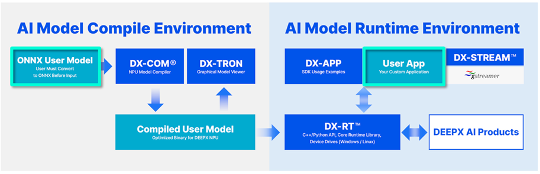
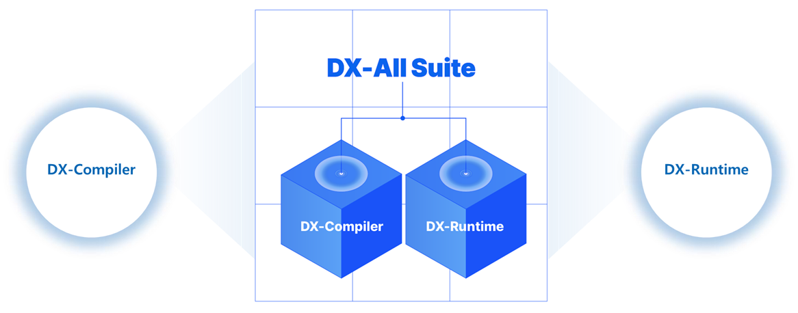
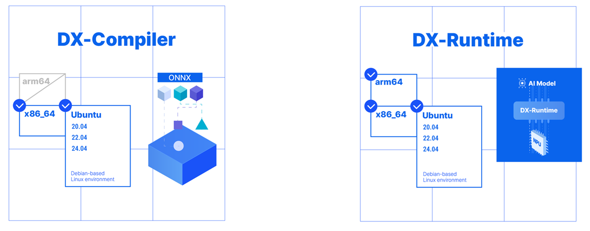

# DXNN® - DEEPX NPU SDK (DX-AS: DEEPX All Suite)

DX-AS (DEEPX All Suite) is an integrated environment of frameworks and tools that enables inference and compilation of AI models using DEEPX devices. Users can build the integrated environment by installing individual tools, but DX-AS maintains optimal compatibility by aligning the versions of the individual tools.

## Quick Guide

The DEEPX SDK is primarily divided into two key parts.

The first is the **AI Model Compile Environment** part, which **transforms your AI model** into an optimized format for efficient execution on the DEEPX NPU.

The second is the **AI Model Runtime Environment** part, which **executes the compiled AI model on the actual DEEPX NPU hardware** to generate results

With just an ONNX-format AI model and your applications source code, you can harness the full power of the DEEPX NPU by using the DEEPX SDK (highlighted in blue) to run your AI model quickly and efficiently

By using DX-Allsuite, you can set up both components seamlessly, without managing them individually.

You can install each part independently as needed. For instance, set up only the **dx-compiler environment on your development system**, and only the **dx-runtime environment on the target device**.

### [dx-compiler](https://github.com/DEEPX-AI/dx-compiler)

**Core Components**
  - DX-COM: Converts ONNX models into highly optimized, NPU-ready binaries.

**Flexibility & Support**
  - OS: Compatible with Debian-based Linux (Ubuntu 20.04, 22.04, 24.04)
  - Architecture: Supports x86_64 only

**Easy Installation**
  - Our single script automates the full setup process
  - All DX-Compiler components are ready to use upon completion.

**You can install dx-compiler by following the instructions at this [LINK](https://github.com/DEEPX-AI/dx-all-suite/blob/staging/docs/source/installation.md#local-installation).**

### [dx-runtime](https://github.com/DEEPX-AI/dx-runtime)

**Core Components**
  - DX-Runtime & NPU Driver: Foundational software for NPU control
  - DX-APP: C++ and Python examples to jump-start your projects
  - DX-Stream: GStreamer integration for seamless multimedia pipelines

**Flexibility & Support**
  - OS: Compatible with Debian-based Linux (Ubuntu 20.04, 22.04, 24.04)
  - Architecture: Supports both x86_64 and arm64

**Easy Installation**
  - Our script automates the entire process
  - One-time reboot is required after installation to finalize the NPU Driver setup

**You can install dx-runtime by following the instructions at this [LINK](https://github.com/DEEPX-AI/dx-all-suite/blob/staging/docs/source/installation.md#install-dx-runtime-environment).**

## Documentation

For detailed guides on running demo applications and templates, refer to the following documents:

### Introduction
[Link](docs/source/index.md)

### Installation Guide
[Link](docs/source/installation.md)

### Getting Started
[Link](docs/source/getting-started.md)

### Version Compatibility
[Link](docs/source/version_compatibility.md)

### FAQ
[Link](docs/source/faq.md)

### Make Docuemtment
[Link](docs/make_docs.md)

