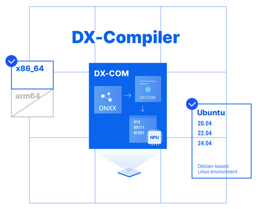
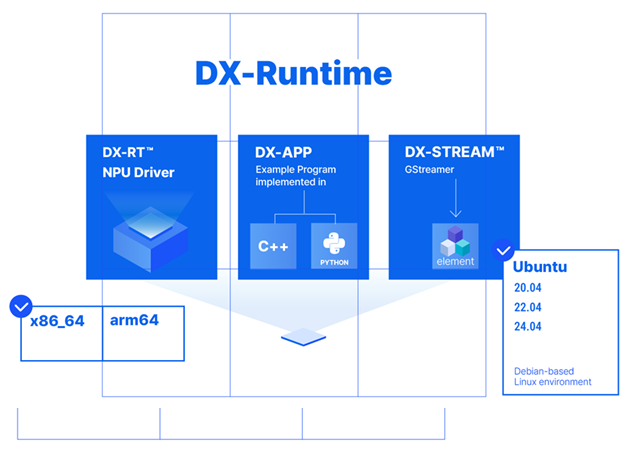

# DX-AllSuite Architecture Overview

This guide provides a comprehensive overview of the **DXNN (DEEPX Neural Network)** SDK architecture, its core modules, and supported environments.  

## Why DX-AllSuite?

**DX-AllSuite** integrates the complex pipeline—from model optimization to target hardware deployment—into a **Single Workflow**.  

- **Zero-Code Deployment**: Deploy logic verified on a desktop directly to edge devices without any code modifications.  
- **Resource Optimization**: Reduce the time spent on environment setup and system integration, allowing you to focus on building high-performance AI applications.  
- **End-to-End Solution**: Provides model compilation, simulation, runtime execution, and monitoring within a single package.  

## System Architecture & Core Modules

  
  
<strong>Figure. DXNN SDK Full Architecture Overview.</strong>

**[1] AI Model Compile Environment (Host Platform)**  
This environment converts and optimizes trained AI models into DEEPX NPU-proprietary binaries (`.dxnn`). It supports the **x86_64** PC environment.  

- **DX-COM (Compiler)**: The core compiler that generates `.dxnn` binaries based on ONNX models and user configuration (JSON) files. It uses proprietary algorithms to convert models into hardware-optimized instructions while minimizing accuracy loss, enabling low-latency and high-efficiency inference.  
-	**DX-TRON (Visualizer)**: A GUI tool for visualizing and analyzing the structure of `.dxnn` models. It provides color-coded graphs to intuitively show workload distribution between the NPU and CPU, helping developers understand execution flow and optimize performance.  
- **DX-ModelZoo**: A repository of pre-trained models optimized for DEEPX NPUs. By providing ONNX models, JSON configs, and pre-compiled `.dxnn` binaries, it allows developers to test and deploy models immediately without going through the compilation process.  

**[2] AI Model Runtime Environment (Target Platform)**  
This environment runs optimized `.dxnn` models on actual NPU hardware and integrates them into applications. It supports both **x86_64** and **aarch64** environments.  

-	**DX-RT (Runtime)**: The core software that interacts with firmware and drivers to run `.dxnn` models on the DEEPX NPU. It manages model loading, I/O buffers, inference execution, and real-time monitoring, offering flexible control via C/C++ and Python APIs.  
-	**DX-APP**: Sample applications built on DX-RT. It provides reference code for key vision tasks (Object Detection, Face Recognition, Image Classification, etc.), enabling developers to quickly build unique AI apps using these templates.  
-	**DX-Stream**: A GStreamer-based custom plugin that connects real-time video data to DEEPX NPU inference. It provides a modular pipeline covering pre-processing, inference, and post-processing, optimized for high-performance vision AI applications like intelligent cameras.  
- **Driver & FW**: Supports high-speed data communication via the PCIe interface and manages NPU resource scheduling and power. It ensures stability between hardware and software while maximizing the hardware's potential for a seamless inference environment.  

**Development Workflow**  
The path from a trained model to NPU acceleration follows four logical steps.  

- **Step 1.	Model Preparation**: Export a model trained in PyTorch or TensorFlow to the **ONNX** format.  
- **Step 2.	Optimization (Host)**: Compile the model using **DX-COM** with quantization and hardware optimization to generate a `.dxnn` file.  
- **Step 3.	Deployment (Target)**: Transfer the generated `.dxnn` file to the target device.  
- **Step 4.	Execution (Target)**: Run high-speed inference on the DEEPX NPU via **DX-RT**.  

## Technical Compatibility (Support Matrix)

**DX-AllSuite** provides proven compatibility with the latest operating systems and a wide range of hardware architectures, ensuring a stable bridge between your development environment and edge deployment.  

  
  
  
<strong>Figure. DX-Compiler & DX-Runtime Support Ecosystem.</strong>

### Hardware & OS (Platform)

The following table outlines the supported environments for both the compilation (Host) and execution (Target) phases.  

| Category | DX-Compiler (Host) | DX-Runtime (Target) |
| :--- | :--- | :--- |
| **Architecture** | x86_64 | x86_64, aarch64 |
| **OS** | Ubuntu 24.04/22.04/20.04, Fedora, Redhat, CentOS | Ubuntu 24.04/22.04/20.04/18.04, Debian 13/12, Windows 11/10 |
| **Languages** | Python 3.8, 3.9, 3.10, 3.11, 3.12 | Python 3.8 or higher, C++14 or higher (C++17 for MSVC/Windows) |

### Model & Software Ecosystem

**Supported AI Frameworks**  
DX-AllSuite seamlessly integrates with industry-standard frameworks to minimize refactoring.  

- **Frameworks**: Ultralytics (YOLO), TensorFlow, PyTorch, Keras  
- **Formats**: ONNX (Primary exchange format)  

**Global AI Ecosystem Partners**  
We maintain strong technical partnerships to ensure the DXNN SDK operates flawlessly within various industry-leading platforms.  

- **Cloud & Platform**: AWS (IoT Greengrass), Baidu, DeGirum  
- **Vision & Algorithms**: Ultralytics (YOLO Series), CVEDIA  
- **VMS & Security**: Network Optix (Nx), VCA (Applied Intelligence)  
- **Embedded OS**: Wind River (VxWorks)  

## DEEPX ModelZoo & Supported Tasks

DEEPX ModelZoo is a comprehensive repository providing **over 270 pre-validated models**. It allows users to immediately verify performance and accuracy across various hardware profiles without the need for a manual compilation process.  

| Task | Representative Models |
| :--- | :--- |
| **Image Classification** | ResNet, ResNeXt, MobileNet, EfficientNet (Lite/V2), ViT/DeiT/BEiT, MobileViT, FastViT, CasViT, RegNet, ShuffleNet, VGG |
| **Object Detection** | YOLO families (YOLOv3–YOLOv11, YOLOX, YOLO26), SSD, EfficientDet, NanoDet, DamoYOLO |
| **Instance Segmentation** | YOLACT, YOLOv5-Seg, YOLOv8-Seg, YOLO26-Seg |
| **Semantic Segmentation** | DeepLabV3/DeepLabV3+, SegFormer, BiSeNet, UNet |
| **Oriented Object Detection (OBB)** | YOLO26-OBB |
| **Zero-shot Instance Segmentation** | FastSAM |
| **Face Detection** | RetinaFace, SCRFD, ULFGED, YOLOv5-Face, YOLOv7-Face |
| **Face Recognition** | ArcFace (IResNet50/100, MobileFaceNet, R50) |
| **Face Landmark** | TDDFA v2 (MobileNet variants) |
| **Face Attribute** | FaceAttrResNetV1-18 |
| **Pose Estimation (Human)** | CenterPose, YOLO26-Pose, YOLOv8-Pose |
| **Hand Landmark** | MediaPipeHandsLite |
| **Person Attribute** | DeepMAR (ResNet18/50) |
| **Depth Estimation** | FastDepth, SCDepthV3 |
| **Image Denoising** | DnCNN variants |
| **Low-light Enhancement** | ZeroDCE |
| **Super-resolution** | ESPCN (x2/x3/x4) |

**Key Features of the ModelZoo Pipeline**  

-	**YAML-Centric Orchestration**: Manage pre-processing, post-processing, evaluation, and compilation settings in a single YAML file for high reproducibility and easy operation.  
-	**Unified Workflow**: Integrates list, info, eval, compile, and benchmark functions into a single CLI system, allowing flexible combination of stages.  
-	**Optimized Multi-Profile Support**: All models are quantized and optimized for the DEEPX NPU architecture, ensuring consistent validation from ONNX evaluation to NPU execution.  
-	**Extensible Registry**: Supports plugin-style extensions for pre/post-processing, datasets, and evaluators, enabling fast onboarding of custom models.  
-	**Broad Task Coverage**: Extensive support for service-ready CV tasks beyond basic classification and detection, including Face Analysis, OBB, and Image Enhancement.  

Copyright © DEEPX. All rights reserved.  

---
