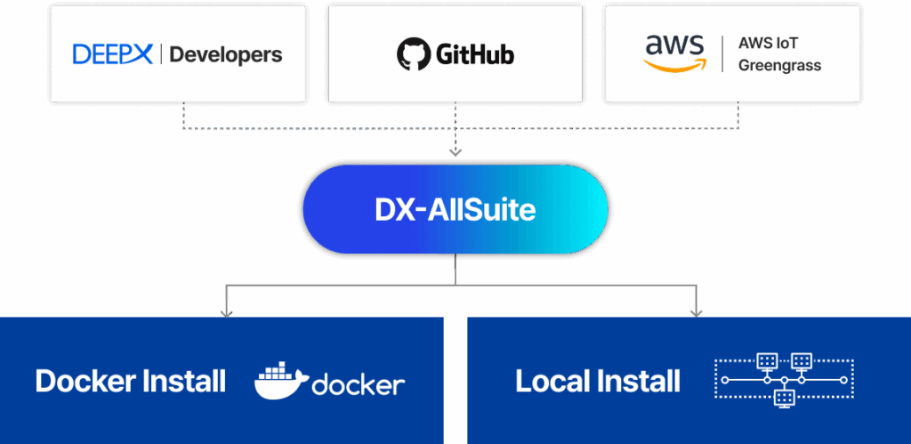
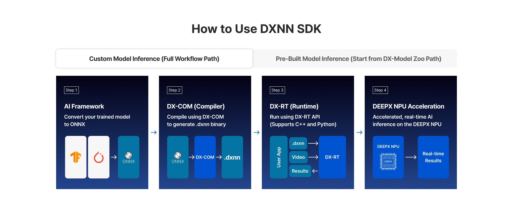
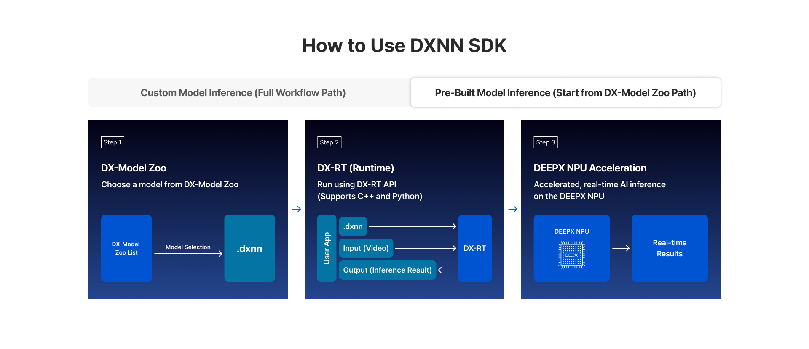

# Setting Up Environment

**DX-AllSuite**는 DEEPX 장치를 검증하고 활용하기 위한 통합 환경 구축 도구입니다. 이 가이드는 복잡한 의존성 문제를 해결하고 로컬 호스트와 Docker 컨테이너 모두에서 일관된 개발 경험을 제공합니다.  

<div align="center">
  
  <p><strong>Figure. DX-AllSuite Supported Environments & Integrations.</strong></p>
</div>

**설치 요약**  

**[공통] 1. 사전 준비**: 소스 코드를 확보하고 가상 환경 관리 정책을 이해합니다.  

**[선택]** 설치 경로를 선택합니다.  
- **[Route A] 2. Docker 설치**: 컨테이너 기반의 격리된 설치 방식입니다.  
- **[Route B] 3. 로컬 설치**: 호스트 OS에 직접 설치하는 방식입니다.  

---

## Prerequisites

안정적인 설치를 위해 다음 단계를 먼저 수행하십시오.  

### Repository Cloning and Submodule Synchronization

**DX-AllSuite**는 여러 독립적인 모듈의 집합입니다. 하위 모듈이 누락되면 컴파일 및 런타임 실행이 불가능합니다. 아래 명령어를 정확히 사용해 주십시오.  

**A. 저장소 복제 (하위 모듈 포함)**  
```Bash
# Via HTTPS (Recommended)
git clone --recurse-submodules https://github.com/DEEPX-AI/dx-all-suite.git

# Via SSH
git clone --recurse-submodules git@github.com:DEEPX-AI/dx-all-suite.git

cd dx-all-suite
```

**B. (선택 사항) 기존 저장소 업데이트**  
이미 저장소를 복제했지만 하위 폴더가 비어 있는 경우, **반드시** 수동 초기화를 수행해야 합니다.  
```Bash
# Initialize and update submodules to the latest state
git submodule update --init --recursive

# Check submodule status (Success if no '-' prefix exists)
git submodule status
```

**C. (선택 사항) Docker 환경 준비**  
Docker 경로를 사용할 계획이지만 Docker가 설치되어 있지 않은 경우, 제공된 자동화 스크립트를 사용하십시오.  
```Bash
# Automatic installation of Docker and Docker Compose
./scripts/install_docker.sh
```

### Automated Environment Management

**DX-AllSuite**는 패키지 충돌을 방지하기 위해 Python 가상 환경(venv) 생성을 자동화합니다. 설치 스크립트는 각 실행 컨텍스트에 최적화된 독립적인 환경을 자동으로 구성하므로 사용자가 수동으로 가상 환경을 만들 필요가 없습니다.  

- **컴파일러 환경**: `dx-compiler/venv-dx-compiler`에 생성됨    
- **런타임 환경**: `dx-runtime/venv-dx-runtime`에 생성됨    

!!! warning "주의"  
    개별 모듈(예: `dx-rt`만 설치)을 설치하는 경우, 설치 실패를 방지하기 위해 스크립트에 의해 생성된 해당 가상 환경을 반드시 활성화(`source .../activate`)해야 합니다.  

### SDK Workflow Guide

**DX-AllSuite**는 사용자 본인의 모델을 가져오느냐, 아니면 사전 최적화된 모델을 사용하느냐에 따라 DEEPX NPU를 활용하는 두 가지 경로를 제공합니다. SDK는 원활한 개발 경험을 보장하기 위해 필요한 가상 환경과 의존성을 자동으로 관리합니다.  

**[경로 A] 사용자 정의 모델 추론 경로**  
사용자가 직접 훈련시킨 모델을 변환하고 배포하는 표준 워크플로우입니다.  

<div align="center">
  
  <p><strong>Figure. Custom Model Inference.</strong></p>
</div>


이 경로는 프레임워크에서 훈련된 특정 모델 아키텍처를 보유하고 있으며 이를 DEEPX 하드웨어에 최적화해야 하는 사용자를 위해 설계되었습니다.  

- **단계 1 (Source)**: PyTorch 또는 TensorFlow와 같은 주요 AI 프레임워크로부터 훈련된 모델과 소스 코드를 확보합니다.  
- **단계 2 (Export)**: 모델을 **DX-COM**이 인식하는 표준 형식인 **ONNX**로 내보냅니다.  
    : Tip: NPU 사양과 최대 호환성을 보장하기 위해 입력 텐서 크기를 설정하고 **Opset 11 이상**을 사용하십시오.  
- **단계 3 (DX-COM)**: 컴파일러 가상 환경(`venv-dx-compiler`) 내에서 ONNX 모델을 NPU에 최적화된 `.dxnn` 바이너리로 변환합니다.  
- **단계 4 (DX-RT)**: 생성된 모델을 로드하고 런타임 가상 환경(`venv-dx-runtime`)을 사용하여 타겟 장치에서 추론을 실행합니다.  
- **단계 5. (NPU Acceleration)**: 실시간 AI 추론 성능을 확인하고 최종 출력을 검토합니다.  

**[경로 B] 사전 컴파일된 모델 경로 (빠른 실행)**  
즉각적인 하드웨어 검증을 위한 "패스트 트랙(Fast Track)"입니다.  

<div align="center">
  
  <p><strong>Figure. Pre-Built Model Inference.</strong></p>
</div>

이 경로는 업계 표준 모델을 사용하여 DEEPX NPU 성능을 빠르게 벤치마킹하거나 하드웨어 통합을 테스트하려는 사용자에게 이상적입니다.  

- **단계 1 (Select)**: **DEEPX ModelZoo** 또는 샘플 데이터에서 사전 검증된 `.dxnn` 모델을 선택합니다.  
- **단계 2 (DX-RT)**: 별도의 컴파일 과정 없이 런타임 환경(`venv-dx-runtime`)에서 선택한 모델을 즉시 로드합니다.  
- **단계 3 (NPU Acceleration)**: 하드웨어 가속 추론을 실행하고 **FPS** 및 **지연 시간(Latency)**과 같은 주요 성능 지표를 분석합니다.  

---

## Docker Installation

Docker를 사용하면 복잡한 의존성 설정 없이 격리된 환경에서 **DX-AllSuite**를 실행할 수 있습니다.  

### Host System Preparation (Critical)

Docker 컨테이너는 호스트 커널을 공유하므로, NPU 하드웨어 인식을 위해 **반드시 호스트 시스템(PC)에 드라이버가 먼저 설치되어 있어야 합니다**.  

**NPU 드라이버 설치 (호스트)**  
먼저 **호스트 PC**에서 설치 스크립트를 실행하십시오.   
```Bash
./dx-runtime/install.sh --target=dx_rt_npu_linux_driver
```

**B. 서비스 데몬(`dxrtd`) 충돌 방지**  
`dxrtd` 인스턴스는 호스트와 컨테이너를 통틀어 단 하나만 실행될 수 있습니다. 컨테이너를 실행하기 전에 호스트 서비스를 중지하십시오.  
```Bash
sudo systemctl stop dxrt.service
```

### Build Docker Image and Run Container

**A. 이미지 빌드**  
`--all` 옵션을 사용하면 컴파일러, 런타임, ModelZoo가 포함된 통합 이미지를 빌드합니다.  
```Bash
# Build integrated image (Based on Ubuntu 24.04)
./docker_build.sh --all --ubuntu_version=24.04

# Build specific environment only (Using --target)
./docker_build.sh --target=dx-runtime --ubuntu_version=24.04
```

**B. 컨테이너 실행**  
이미지 빌드가 완료된 후 컨테이너를 실행합니다.  
```Bash
./docker_run.sh --all --ubuntu_version=24.04
```

!!! warning "GUI 환경 관련 주의"  
    X11 경고나 마운트 오류(예: 디스플레이를 열 수 없음)가 발생하면 호스트 OS가 **Wayland** 세션을 사용 중일 가능성이 높습니다. **05. FAQ Troubleshooting Guide**의 [**Q2. X11 Session Warnings & Mount Errors (Wayland Issues)**](05_FAQ_Troubleshooting_Guide.md#q2-x11-session-warnings--mount-errors-wayland-issues)를 참고하십시오.  

### Container Access and Task Guide

#### A. DX-Compiler 환경 (모델 변환)
DX-Compiler 환경은 하드웨어에 최적화된 `.dxnn` 바이너리를 생성하는 데 사용됩니다.  

**A-1. 컨테이너 접속**  
컨테이너 내에서 작업을 수행하려면, **반드시** 먼저 실행 중인 컨테이너의 쉘에 로그인해야 합니다.  
```Bash
# 1. Run in Host Terminal: Enter the container
docker exec -it dx-compiler-24.04 bash 

# 2. Inside Container: Navigate to the work directory
cd /deepx/dx-compiler/dx_com
```

!!! warning "경로 논리 주의"  
    `/deepx` 경로는 컨테이너 내부의 절대 경로입니다. 이 경로는 호스트 머신에는 존재하지 않습니다. 명령을 실행하기 전에 터미널 프롬프트가 `root@...` 또는 `user@container_id`로 변경되었는지 확인하십시오.  

**A-2. 샘플 모델 컴파일**  
샘플 모델은 설치 시 `./sample_models/` 디렉토리에 미리 다운로드됩니다. 다음 두 가지 방법 중 하나를 사용하여 컴파일할 수 있습니다.  

- **방법 1**: 일괄 컴파일 (권장)  
제공된 스크립트를 사용하여 모든 샘플 모델을 자동으로 컴파일합니다.  
```Bash
../example/3-compile_sample_models.sh
```

- **방법 2**: 수동 컴파일 (CLI)  
세밀한 제어를 위해 가상 환경을 활성화하고 `dxcom` 도구를 직접 사용합니다.  
```Bash
source ../venv-dx-compiler/bin/activate  # Activate venv

dxcom -m sample_models/onnx/YOLOV5S-1.onnx \
      -c sample_models/json/YOLOV5S-1.json \
      -o output/YOLOV5S-1
```

**A-3. 결과 확인**  
성공적으로 완료되면 최적화된 `.dxnn` 바이너리가 `output/` 디렉토리(또는 `-o` 플래그로 지정한 경로)에 생성됩니다.  

- **출력 파일:**: `output/YOLOV5S-1.dxnn`  
- **다음 단계**: 이 파일을 하드웨어 실행을 위해 **런타임 환경**으로 전달합니다.  

#### B. DX-Runtime 환경 (NPU 추론 및 스트리밍)
**DX-Runtime** 환경은 DEEPX NPU 하드웨어를 사용하여 모델 추론을 실행하고 고성능 비디오 스트림을 처리하기 위해 설계되었습니다.  

**B-1. 컨테이너 접속 및 상태 확인**  
추론을 실행하기 전에 컨테이너가 NPU 하드웨어와 통신할 수 있는지 확인하십시오.  
```Bash
# 1. Run from the host terminal: Enter the container
docker exec -it dx-runtime-24.04 

# 2. Inside Container: Verify NPU hardware recognition
dxrt-cli -s
```

**B-2. 샘플 애플리케이션 실행 (`dx_app`)**  
이 모듈은 다양한 비전 작업에 대한 추론 데모를 제공합니다.  

- **작업 디렉토리**: `/deepx/dx-runtime/dx_app`  

```Bash
cd /deepx/dx-runtime/dx_app

# 1. Prepare resources (Download .dxnn models and sample images)
./setup.sh

# 2. Run demo 
./run_demo.sh 			# Run C++ based demo
./run_demo_python.sh 		# Run Python demo
```

!!! note "데모 선택"  
    실행 시 터미널에 사용 가능한 데모 목록(0, 1, 2...)이 표시됩니다. 해당 번호를 입력하고 **Enter**를 누르면 시작됩니다.  

**B-3. 스트리밍 프레임워크 실행 (`dx_stream`)**  
이 모듈은 실시간 다채널 비디오 스트림 처리에 최적화된 GStreamer 기반 모듈입니다.  

- **작업 디렉토리**: `/deepx/dx-runtime/dx_stream`  

```Bash
cd /deepx/dx-runtime/dx_stream

# 1. Prepare assets (Downloads streaming-specific models and video assets) 
./setup.sh

# 2. Run the streaming demo (C++ based)
./run_demo.sh
```

!!! note "시나리오 선택"  
    터미널에 표시되는 시나리오 번호를 입력하여 특정 스트리밍 시나리오를 선택할 수 있습니다.  

**경로 관련 주의사항**  
"`File not found`" 오류를 방지하려면 **호스트** 터미널과 **컨테이너** 터미널을 명확히 구분하는 것이 중요합니다.  

- **Docker 컨테이너 내부**: 항상 `/deepx` 로 시작하는 절대 경로를 사용하십시오. (예: `cd /deepx/dx-runtime/...`).  
- **로컬 호스트 환경**: 현재 디렉토리를 기준으로 상대 경로를 사용하십시오 (예: `cd ./dx-runtime/...`).  

!!! warning "일반적인 오류"  
    호스트 터미널에서 `/deepx`로 시작하는 경로로 진입을 시도하면 시스템은 "`No such file or directory`" 오류를 반환합니다. 이동하기 전에 항상 프롬프트가 `root@...` 또는 `user@container_id`로 시작하는지 확인하십시오.  

### [Docker] Advanced Troubleshooting (Multi-Runtime Containers)

`dxrtd` 데몬은 시스템 내에서 단일 인스턴스(Singleton)로 실행되어야 합니다. 여러 컨테이너를 동시에 실행하려면, **반드시** 자동 실행을 방지하도록 `Entrypoint`를 수정해야 합니다.  

- **방법 1**: Dockerfile 수정  
`docker/Dockerfile.dx-runtime` 파일을 편집하여 기본 시작 명령을 주석 처리하고 영구 대기 상태로 대체합니다.  
```Dockerfile
# 1. Comment out the existing settings
# ENTRYPOINT [ "/usr/local/bin/dxrtd" ]

# 2. Enable infinite wait settings to keep containers running
ENTRYPOINT ["tail", "-f", "/dev/null"]
```

- **방법 2**: docker-compose 수정  
Docker Compose를 사용하는 경우, `docker/docker-compose.yml`의 해당 서비스 섹션에서 기본 Entrypoint를 직접 덮어쓸 수 있습니다.  
```YAML
services:
dx-runtime:
		entrypoint: ["/bin/sh", "-c"]
		command: ["sleep infinity"]
```

!!! note "수동 시작"  
    위 설정이 적용되면 NPU는 대기 상태가 됩니다. 컨테이너에 접속한 후 `dxrtd &` 명령을 사용하여 수동으로 실행하십시오.  

### [Docker] Verification of Installation Results (Sanity Check)

설치가 성공적으로 완료되었는지, 소프트웨어와 하드웨어가 올바르게 통신하는지 최종 점검을 수행합니다.  

#### A. 하드웨어 인식 확인 (`dxrt-cli`)
컨테이너 내부에서 다음 명령을 실행하여 NPU가 보이고 작동하는지 확인합니다.   
```Bash
dxrt-cli -s
```

**성공 체크리스트**  
출력이 다음 세 가지 조건을 충족하면 하드웨어 통합에 성공한 것입니다.   

- **[x] 장치 인식**: `Device 0: M1` (또는 특정 모델명)이 표시됨.  
- **[x] 버전 정보**: `RT Driver version`, `FW version` 등에 유효한 버전 번호가 나타남.  
- **[x] 데몬 상태**: "`Other instance of dxrtd is running`" 과 같은 오류 메시지가 없음.  

[정상 출력 예시]  
```Plaintext
DX-RT v3.2.0
========================================================
* Device 0: M1, Accelerator type
--------------------- Version ---------------------
* RT Driver version : v2.1.0
* FW version :      v2.5.0
-------------------------------------------------------
... (Continued)
```

#### B. 시스템 일관성 확인
이 스크립트는 모든 개별 모듈이 지정된 경로에 올바르게 배치되었고 실행 준비가 되었는지 일괄 점검합니다.  
```Bash
# Check the integrity of the runtime environment
./dx-runtime/scripts/sanity_check.sh
```

모든 항목에 대해 **[OK]** 또는 **PASS**가 출력되면 서비스 개발을 시작할 준비가 된 것입니다.  

---

## Local Installation

**DX-AllSuite**를 **호스트 OS**에 직접 설치하면 하드웨어 성능을 극대화하고 모든 소프트웨어 모듈 간의 원활한 호환성을 보장할 수 있습니다. 이 방법은 프로덕션 환경 및 고급 성능 벤치마킹에 권장됩니다.  

### DX-Compiler Installation (DX-COM, DX-TRON)

DX-Compiler(DX-COM)는 지원되는 Linux 배포판에서 CLI 도구 또는 Python 모듈로 사용할 수 있습니다.  

**사용 방식의 차이점**  

- **CLI 도구 (커맨드 라인 인터페이스)**: 터미널(Bash)에서 직접 `dxcom` 명령을 입력하여 컴파일을 수행합니다. 추가 코딩 없이 빠른 실행 및 자동화된 쉘 스크립트에 적합합니다.  
- **Python 모듈 (라이브러리)**: Python 스크립트 내에서 `import dx_com`을 통해 함수나 클래스를 호출합니다. 컴파일러를 기존 AI 훈련 또는 자동화 파이프라인에 통합하는 데 선호되는 방법입니다.

!!! warning "배포 방식 변경 알림"  
    **독립 실행형(standalone executable) 배포 방식은 더 이상 지원되지 않습니다**. 이 가이드는 의존성 관리와 Python 환경 통합을 보장하는 최신 **Wheel 기반** 설치 워크플로우를 설명합니다.  

#### A. 설치 전 요구 사항
**DX-COM**을 설치하기 전에 핵심 유틸리티 및 그래픽 작업을 지원하기 위해, **반드시** 다음 시스템 라이브러리를 설치해야 합니다.  

- **`libgl1-mesa-glx`**: 그래픽 처리를 위한 OpenGL 런타임 지원  
- **`libglib2.0-0`**: 핵심 유틸리티 라이브러리 (GNOME/GTK 관련)  

**설치 명령**  
```Bash
sudo apt-get update
sudo apt-get install -y --no-install-recommends libgl1-mesa-glx libglib2.0-0 make
```

#### B. 설치 방법
**지원 환경**  

- **OS**: Linux (x86_64)  
- **Python 버전**: 3.8, 3.9, 3.10, 3.11, 3.12 (설치 스크립트가 버전을 자동으로 감지함)  

**통합 패키지 설치**  
제공된 `install.sh` 스크립트는 Python 버전 감지 및 패키지 설치를 포함한 모든 과정을 한 번에 처리합니다.  
```Bash
# Run the interactive installation script (recommended)
./dx-compiler/install.sh
```

#### C. 검증 및 사용
설치 후, 가상 환경(`venv-dx-compiler`)을 활성화하여 설정을 확인합니다.  
```Bash
# 1. Activate the Virtual Environment
source ./dx-compiler/venv-dx-compiler/bin/activate

# 2. Verify Installed Version (CLI and Python Modules)
dxcom --version
python3 -c "import dx_com; print(dx_com.__version__)"

# 3. Access Help Documentation
dxcom -h
```

- **샘플 데이터 위치**: `./dx-compiler/dx_com/sample_models/`  

!!! note "팁"  
    샘플 데이터 자동 다운로드에 실패한 경우, 다음 스크립트를 사용하여 수동으로 자산을 가져올 수 있습니다.  
    - `./dx-compiler/example/1-download_sample_models.sh` (모델 데이터)  
    - `./dx-compiler/example/2-download_sample_calibration_dataset.sh` (교정 데이터)  

#### D. DX-TRON (GUI 시각화)
**DX-TRON**은 모델 구조와 작업 부하 분산을 검사하기 위한 시각적 분석 도구입니다. 환경에 맞는 실행 모드를 선택하십시오.   

- **로컬 실행 (데스크톱)**: 터미널에 `dxtron`을 입력하거나 다음 스크립트를 실행하십시오.  
```bash
./dx-compiler/run_dxtron_appimage.sh
```

- **웹 서버 실행 (원격/Docker)**: 웹 서버 스크립트를 실행하고 포트를 지정하십시오.  
```bash 
./dx-compiler/run_dxtron_web.sh --port=8080
```
그 후, 브라우저에서 [**http://localhost:8080**](http://localhost:8080)으로 접속하십시오.  

- **Windows 사용자**: [**DEEPX Developer Portal**](https://developer.deepx.ai)에서 전용 Windows 설치 프로그램을 직접 다운로드할 수 있습니다.  

### DX-Runtime Installation (RT, Driver, FW, App, Stream)

**DX-Runtime** 스택은 DEEPX NPU 하드웨어를 제어하고 AI 애플리케이션을 실행하는 데 필요한 핵심 소프트웨어 계층입니다. 각 구성 요소는 `./dx-runtime` 디렉토리 내의 하위 모듈로 관리됩니다.  

#### A. 모듈 빌드 및 설치
요구 사항에 따라 전체 설치를 수행하거나 특정 모듈만 선택하여 설치 시간을 단축할 수 있습니다.  
```Bash
# Option 1: Install all modules (Driver, FW, RT, App, Stream)
./dx-runtime/install.sh --all

# Option 2: Full install excluding firmware
# (Use this if your NPU already has the latest FW version)
./dx-runtime/install.sh --all --exclude-fw

# Option 3: Install a specific module only
./dx-runtime/install.sh --target=<module_name>
```

#### B. 펌웨어 (DX-FW) 업데이트 및 활성화
펌웨어 업데이트는 매우 중요한 과정입니다. 하드웨어 로직이 올바르게 초기화되도록 다음 단계를 정확히 따르십시오.  

**단계 1. 펌웨어 업데이트**  
자동 설치 스크립트 또는 전용 CLI 도구를 사용하여 펌웨어를 업데이트할 수 있습니다.  
```Bash
# Method 1. Using the installation script
./dx-runtime/install.sh --target=dx_fw

# Method 2. Manual update using dxrt-cli
dxrt-cli -u ./dx-runtime/dx_fw/m1/X.X.X/mdot2/fw.bin
```

**단계 2. 콜드 부트(Cold Boot) 수행**  
시스템을 완전히 종료하고 **전원을 껐다가 다시 켜는 것을 강력히 권장합니다**. 단순한 '다시 시작(Restart)'은 하드웨어 초기화에 충분하지 않을 수 있습니다.  

**단계 3. 시스템 재부팅**  
설치가 완료되면 반드시 `sudo reboot`를 수행하여 설치된 커널 드라이버를 활성화하십시오.  

### [Local] Installation Verification (Sanity Check)

로컬 설치가 완료되면 하드웨어와 소프트웨어가 올바르게 통신하는지 최종 확인을 수행합니다.

#### A. 하드웨어 및 버전 확인 
다음 명령을 실행하여 시스템에서 인식된 NPU 장치에 대한 정보를 표시합니다.  
```Bash
dxrt-cli -s
```

**성공 체크리스트**  
- **[x] 장치 인식**: `Device 0: M1`이 표시됩니까?  
- **[x] 버전 정보**: `RT Driver`, `PCIe Driver`, `FW version` 등이 유효한 번호(예: v1.x.x)를 보여줍니까?  
- **[x] 상태**: 하단에 **전압(Voltage)**, **클럭(Clock)**, **온도(Temperature)** 에 대한 실시간 지표가 보입니까?  

#### B. 시스템 무결성 확인
일괄 위생 점검(sanity script)을 실행하여 모든 모듈이 지정된 경로에 위치하는지 확인합니다.  
```Bash
./dx-runtime/scripts/sanity_check.sh
```

!!! note "팁"  
    어떤 항목이라도 **FAIL** 또는 **Not Found**를 반환하는 경우, 모듈 설치 단계(섹션 3-2)를 다시 방문하여 모든 구성 요소가 올바르게 컴파일되었는지 확인하십시오.  
    
Copyright © DEEPX. All rights reserved.

---
