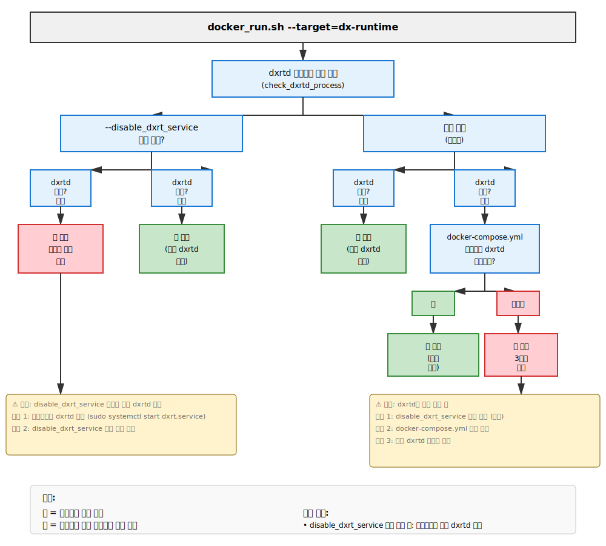

# 설치 가이드

DX-All-Suite은 DEEPX 디바이스를 검증하고 활용하기 위한 환경을 구축하는 도구입니다. DX-All-Suite은 통합 환경을 설정하기 위한 다음의 방법들을 제공합니다:

**로컬 머신에 설치** - 호스트 환경에 직접 DX-All-Suite 환경을 구축합니다 (각 개별 도구 간의 호환성을 유지함).

**Docker 이미지 빌드 및 컨테이너 실행** - Docker 환경 내에서 DX-All-Suite 환경을 빌드하거나, 미리 빌드된 이미지를 로드하여 컨테이너를 생성합니다.

## Preparation

### 메인 리포지토리 클론

```bash
git clone --recurse-submodules https://github.com/DEEPX-AI/dx-all-suite.git
```

또는

```bash
git clone --recurse-submodules git@github.com:DEEPX-AI/dx-all-suite.git
```

#### (선택) 이미 클론된 리포지토리에서 서브모듈 초기화 및 업데이트

```bash
git submodule update --init --recursive
```

### 서브모듈 상태 확인

```bash
git submodule status
```

#### (선택) Docker 및 Docker Compose 설치

```bash
./scripts/install_docker.sh
```

### Python 가상 환경 (권장)

설치 스크립트는 pip를 통해 Python 패키지를 설치합니다. 시스템 패키지와의 충돌을 피하고 깔끔한 환경을 유지하기 위해 Python 가상 환경을 사용하는 것을 강력하게 권장합니다.

```bash
# 가상 환경 생성
python -m venv dx-venv

# 가상 환경 활성화
source dx-venv/bin/activate  # Linux
# 또는
dx-venv\Scripts\activate  # Windows

# 가상 환경이 활성화되었는지 확인
which python
# 출력 결과: /path/to/dx-venv/bin/python
```

가상 환경을 활성화한 후, 아래의 설치 단계를 진행하세요.

---

## 로컬 설치

### DX-Compiler 환경 설치 (dx_com)

`DX-Compiler` 환경은 사전 빌드된 바이너리를 제공하며, 소스 코드는 포함되지 않습니다. 각 모듈은 원격 서버에서 다운로드하여 설치할 수 있습니다.

```bash
./dx-compiler/install.sh
```

위 명령어를 실행하면 DX-Compiler 모듈을 다운로드 및 설치하기 위해 DEEPX Developers' Portal([https://developer.deepx.ai](https://developer.deepx.ai)) 계정 인증이 필요합니다.

Developer Portal 계정이 필요하신 경우, 아래 정보를 포함하여 [sales@deepx.ai](mailto:sales@deepx.ai)로 이메일을 보내주세요.

- 회사/기관명
- 직책

스크립트는 아래의 우선순위에 따라 인증 정보를 획득합니다:

1.  **명령어 실행 시 직접 지정 (1순위):**
    ```bash
    ./dx-compiler/install.sh --username=<user> --password=<pass>
    ```
2.  **환경 변수 사용 (2순위):**

    ```bash
    export DX_USERNAME=<사용자_이메일>
    export DX_PASSWORD=<사용자_비밀번호>
    ./dx-compiler/install.sh
    ```

    또는,
    compiler.properties에 아래와 같이 계정정보를 추가하면 환경변수로 주입됩니다.

    ```bash
    DX_USERNAME=<사용자_이메일>
    DX_PASSWORD=<사용자_비밀번호>
    ```

3.  **프롬프트 입력 (3순위):**
    위 두 가지 방법이 사용되지 않은 경우, 스크립트 실행 중 터미널 프롬프트에서 계정 정보를 직접 입력하라는 메시지가 표시됩니다.

성공적으로 설치되면:

1.  `dx-com` 모듈의 아카이브 파일(`.tar.gz`)이 아래 경로에 다운로드 및 저장됩니다.

    - `./workspace/release/dx_com/download/dx_com_M1_v[VERSION].tar.gz`

2.  다운로드된 모듈이 아래 경로에 압축 해제됩니다.

    - `./workspace/release/dx_com/dx_com_M1_v[VERSION]`
    - 심볼릭 링크가 `./dx-compiler/dx-com`에 생성됩니다.

#### 아카이브 모드 (--archive_mode=y)

`--archive_mode=y` 옵션은 주로 docker_build.sh를 사용하여 `dx-compiler` 환경에 대한 Docker 이미지를 빌드할 때 사용됩니다. 이 모드를 활성화하면, 모듈의 `.tar.gz` 파일을 다운로드하는 것까지만 진행되고 압축 해제 및 심볼릭 링크 생성은 수행되지 않습니다.

```bash
./dx-compiler/install.sh --archive_mode=y
```

위 명령을 실행하면, 모듈 아카이브 파일(\*.tar.gz)이 아래 경로에 다운로드 및 저장됩니다:

archives/dx_com_M1_v[VERSION].tar.gz

이 아카이브 파일들은 Docker 이미지 빌드 프로세스에서 활용될 수 있습니다.

---

### DX-Runtime 환경 설치

`DX-Runtime` 환경은 각 모듈의 소스 코드를 포함하며, `./dx-runtime` 디렉터리에서 Git 서브모듈(`dx_rt_npu_linux_driver`, `dx_rt`, `dx_app`, and `dx_stream`)로 관리됩니다.  
모든 모듈을 빌드 및 설치하려면 아래 명령을 실행하세요.

```bash
./dx-runtime/install.sh --all
```

이 명령어는 다음 모듈을 빌드 및 설치합니다.  
`dx_fw, dx_rt_npu_linux_driver`, `dx_rt`, `dx_app`, `dx_stream`

```bash
./dx-runtime/install.sh --all --exclude-fw
```

`--exclude-fw` 옵션을 사용하여 `dx_fw`를 제외하고 설치가 가능합니다.

#### 특정 모듈만 설치

특정 모듈을 지정하여 설치하려면:

```bash
./dx-runtime/install.sh --target=<module_name>
```

#### `dx_fw` (펌웨어 이미지) 업데이트

`dx_fw` 모듈은 소스 코드를 포함하지 않으며, `fw.bin` 이미지 파일을 제공합니다.  
`dxrt-cli`를 사용하여 펌웨어를 업데이트하려면:

```bash
dxrt-cli -u ./dx-runtime/dx_fw/m1/X.X.X/mdot2/fw.bin
```

또는:

```bash
./dx-runtime/install.sh --target=dx_fw
```

**펌웨어 업데이트 후에는 시스템을 완전히 종료하고 전원을 껐다가 다시 켜는 것이 권장됩니다.**

#### Sanity check

```bash
./dx-runtime/scripts/sanity_check.sh
```

이 명령어를 통해 `dx_rt`와 `dx_rt_npu_linux_driver`가 정상적으로 설치가 되었는지 체크 할 수 있습니다.

---

## Docker를 이용한 설치

### DX-Runtime 및 DX-Compiler 환경 설치

#### 참고 사항

##### 1. Docker 환경을 사용할 경우, NPU 드라이버는 반드시 호스트 시스템에 설치해야 합니다.

```bash
./dx-runtime/install.sh --target=dx_rt_npu_linux_driver
```

##### 2. `docker_run.sh` 스크립트는 호스트나 다른 컨테이너에서 `dxrtd`(서비스 데몬)가 이미 실행 중인지 자동으로 감지합니다.

기본적으로 dx-runtime 컨테이너는 자체 dxrtd 서비스를 시작합니다. 만약 dxrtd가 다른 곳에서 이미 실행 중이면, 스크립트가 컨테이너 시작을 차단하고 세 가지 해결 방법을 제시합니다:

###### 해결 방법 1: --disable_dxrt_service 옵션 사용 (권장)

호스트나 다른 컨테이너에서 실행 중인 dxrtd 서비스를 사용하려면 `--disable_dxrt_service` 옵션을 추가하세요:

```bash
./docker_run.sh --target=dx-runtime --ubuntu_version=24.04 --disable_dxrt_service
```

이 방법이 가장 간단하며, 서비스를 중지하거나 설정 파일을 수정할 필요가 없습니다.

###### 해결 방법 2: docker-compose.yml 수정

`docker/docker-compose.yml` 파일을 수정하여 컨테이너 내부에서 dxrtd가 시작되지 않도록 설정합니다:

- 변경 전:

```yaml
  dx-runtime:
    container_name: dx-runtime-${BASE_IMAGE_NAME}-${OS_VERSION}
    image: dx-runtime:${BASE_IMAGE_NAME}-${OS_VERSION}
    ...
    restart: on-failure
    devices:
      - "/dev:/dev"                           # NPU / GPU / USB CAM
```

- 변경 후:

```yaml
  dx-runtime:
    container_name: dx-runtime-${BASE_IMAGE_NAME}-${OS_VERSION}
    image: dx-runtime:${BASE_IMAGE_NAME}-${OS_VERSION}
    ...
    restart: on-failure
    devices:
      - "/dev:/dev"                           # NPU / GPU / USB CAM

    entrypoint: ["/bin/sh", "-c"]             # 추가됨
    command: ["sleep infinity"]               # 추가됨
```

###### 해결 방법 3: 외부 dxrtd 중지 후 컨테이너 내부에서 실행

호스트에서 실행 중인 dxrtd 서비스를 중지한 후, 컨테이너를 정상적으로 실행합니다:

```bash
sudo systemctl stop dxrt.service
./docker_run.sh --target=dx-runtime --ubuntu_version=24.04
```

##### 3. 여러 개의 DX-Runtime 컨테이너를 동시에 실행하려면, 외부 dxrtd 서비스를 사용할 컨테이너에 `--disable_dxrt_service` 옵션을 사용하세요.

**워크플로우 다이어그램: dxrtd 충돌 감지 및 해결**



**핵심 사항:**
- **`--disable_dxrt_service` 사용 시**: 컨테이너는 외부 dxrtd 필요 (호스트 또는 다른 컨테이너)
- **옵션 미사용 (기본값)**: 컨테이너가 자체 dxrtd 시작, dxrtd가 이미 존재하면 차단
- **자동 감지**: 스크립트가 컨테이너 시작 전 충돌 확인
- **다중 컨테이너**: 하나의 dxrtd 인스턴스를 공유하는 추가 컨테이너에 `--disable_dxrt_service` 사용

#### Docker 이미지 빌드

```bash
./docker_build.sh --all --ubuntu_version=24.04
```

위 명령어는 `dx-compiler`, `dx-runtime` 및 `dx-modelzoo` 환경이 포함된 Docker 이미지를 빌드합니다.  
빌드된 이미지는 아래 명령어로 확인할 수 있습니다.

```bash
docker images
```

```
REPOSITORY         TAG       IMAGE ID       CREATED         SIZE
dx-runtime         24.04     05127c0813dc   41 hours ago    4.8GB
dx-compiler        24.04     b08c7e39e89f   42 hours ago    7.08GB
dx-modelzoo        24.04     cb2a92323b41   2 weeks ago     2.11GB
```

##### 특정 환경만 빌드

```bash
./docker_build.sh --target=dx-runtime --ubuntu_version=24.04
```

```bash
./docker_build.sh --target=dx-compiler --ubuntu_version=24.04
```

```bash
./docker_build.sh --target=dx-modelzoo --ubuntu_version=24.04
```

`--target=<environment_name>` 옵션을 사용하여 `dx-runtime` 또는 `dx-compiler`만 빌드할 수 있습니다.

#### Docker 컨테이너 실행

`docker_run.sh` 스크립트는 컨테이너를 시작하기 전에 dxrtd 충돌을 자동으로 확인합니다. 만약 호스트나 다른 컨테이너에서 dxrtd가 이미 실행 중이면, 스크립트가 충돌을 해결하기 위한 방법을 제시합니다.

`--disable_dxrt_service` 옵션을 사용하는 권장 방법은 [#2](#2-docker_runsh-스크립트는-호스트나-다른-컨테이너에서-dxrtd서비스-데몬가-이미-실행-중인지-자동으로-감지합니다)를 참고하세요.

##### 모든 환경(`dx_compiler`, `dx_runtime` 및 `dx-modelzoo`) 포함 컨테이너 실행

```bash
./docker_run.sh --all --ubuntu_version=<ubuntu_version>
```

실행 중인 컨테이너 확인:

```bash
docker ps
```

```
CONTAINER ID   IMAGE                  COMMAND                  CREATED          STATUS          PORTS     NAMES
f040e793662b   dx-runtime:24.04       "/usr/local/bin/dxrtd"   33 seconds ago   Up 33 seconds             dx-runtime-24.04
e93af235ceb1   dx-modelzoo:24.04      "/bin/sh -c 'sleep i…"   42 hours ago     Up 33 seconds             dx-modelzoo-24.04
b3715d613434   dx-compiler:24.04      "tail -f /dev/null"      42 hours ago     Up 33 seconds             dx-compiler-24.04
```

##### 컨테이너 내부 접속

```bash
docker exec -it dx-runtime-<ubuntu_version> bash
```

```bash
docker exec -it dx-compiler-<ubuntu_version> bash
```

```bash
docker exec -it dx-modelzoo-<ubuntu_version> bash
```

위 명령어를 통해 `dx-compiler`, `dx-runtime` 및 `dx-modelzoo` 환경에 접속할 수 있습니다.

##### 컨테이너 내부에서 DX-Runtime 설치 확인

```bash
dxrt-cli -s
```

출력 예시:

```
DXRT v2.6.3
=======================================================
* Device 0: M1, Accelerator type
---------------------   Version   ---------------------
* RT Driver version   : v1.3.1
* PCIe Driver version : v1.2.0
-------------------------------------------------------
* FW version          : v1.6.0
--------------------- Device Info ---------------------
* Memory : LPDDR5 5800 MHz, 3.92GiB
* Board  : M.2, Rev 10.0
* PCIe   : Gen3 X4 [02:00:00]

NPU 0: voltage 750 mV, clock 1000 MHz, temperature 29'C
NPU 1: voltage 750 mV, clock 1000 MHz, temperature 28'C
NPU 2: voltage 750 mV, clock 1000 MHz, temperature 28'C
DVFS Disabled
=======================================================
```

---

## 샘플 애플리케이션 실행

### dx_app

#### 설치 경로

1. **호스트 환경에서 실행하는 경우:**
   ```bash
   cd ./dx-runtime/dx_app
   ```
2. **도커 컨테이너 내부에서 실행하는 경우:**
   ```bash
    docker exec -it dx-runtime-<ubuntu_version> bash
    cd /deepx/dx-runtime/dx_app
   ```

#### 애셋 설정 (사전 컴파일된 NPU 모델 및 샘플 입력 영상)

```bash
./setup.sh
```

#### `dx_app` 실행

```bash
./scripts/run_detector.sh
fim ./result-app1.jpg
```

**자세한 내용은 [dx-runtime/dx_app/README.md](/dx-runtime/dx_app/README.md).**

---

### dx_stream

#### 설치 경로

1. **호스트 환경에서 실행하는 경우:**
   ```bash
   cd ./dx-runtime/dx_stream
   ```
2. **도커 컨테이너 내부에서 실행하는 경우:**
   ```bash
    docker exec -it dx-runtime-<ubuntu_version> bash
    cd /deepx/dx-runtime/dx_stream
   ```

#### Assets 설정 (사전 컴파일된 NPU 모델 및 샘플 입력 영상)

```bash
./setup.sh
```

#### `dx_stream` 실행

```bash
./run_demo.sh
```

**자세한 내용은 [dx-runtime/dx_stream/README.md](/dx-runtime/dx_stream/README.md)를 참고하세요.**

---

## DX-Compiler 실행

### dx_com

#### 설치 경로

1. **호스트 환경에서 실행하는 경우:**
   ```bash
   cd ./dx-compiler/dx_com
   ```
2. **도커 컨테이너 내부에서 실행하는 경우:**
   ```bash
   docker exec -it dx-compiler-<ubuntu_version> bash
   # cd /deepx/dx-compiler/dx_com
   ```

#### 샘플 ONNX 입력을 사용하여 `dx_com` 실행

```bash
make
dx_com/dx_com \
        -m sample/MobileNetV1-1.onnx \
        -c sample/MobileNetV1-1.json \
        -o sample/MobileNetV1-1
        -o sample/MobileNetV1-1
Compiling Model : 100%|███████████████████████████████| 1.0/1.0 [00:06<00:00,  7.00s/model ]

dx_com/dx_com \
        -m sample/ResNet50-1.onnx \
        -c sample/ResNet50-1.json \
        -o sample/ResNet50-1
        -o sample/ResNet50-1
Compiling Model : 100%|███████████████████████████████| 1.0/1.0 [00:19<00:00, 19.17s/model ]

dx_com/dx_com \
        -m sample/YOLOV5-1.onnx \
        -c sample/YOLOV5-1.json \
        -o sample/YOLOV5-1
        -o sample/YOLOV5-1
Compiling Model : 100%|███████████████████████████████| 1.0/1.0 [00:47<00:00, 47.66s/model ]
```

**자세한 내용은 [dx-compiler/source/docs/02_02_Installation_of_DX-COM.md](/dx-compiler/source/docs/02_02_Installation_of_DX-COM.md)를 참고하세요.**
