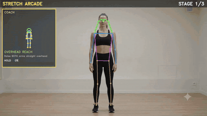
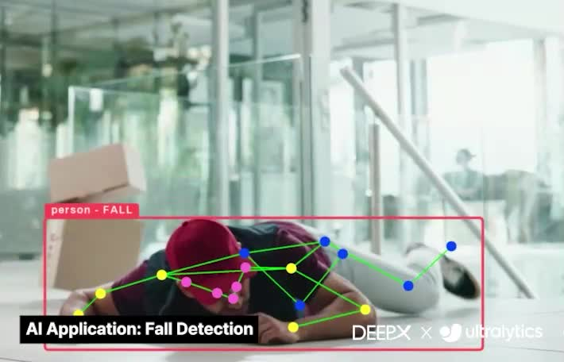
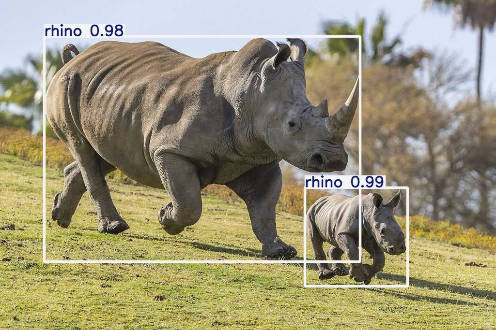
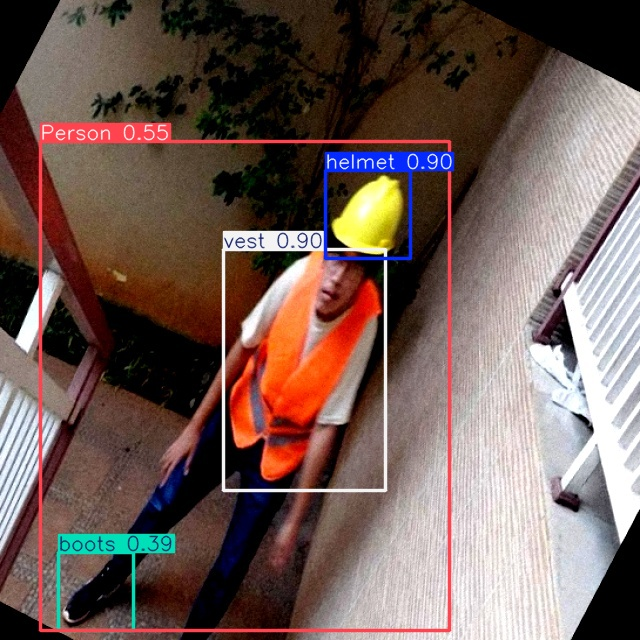
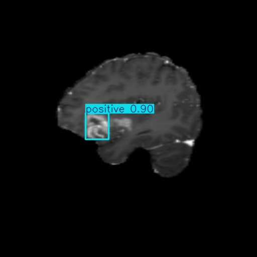
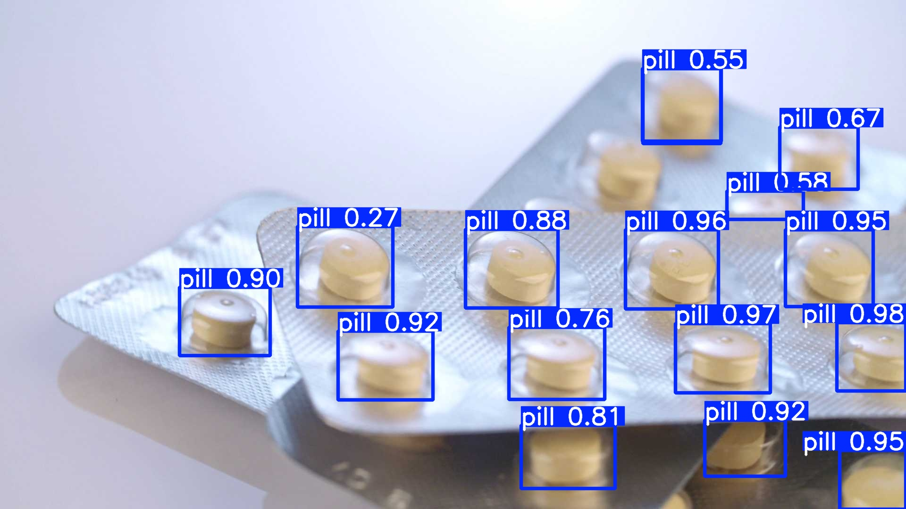

# dx-agent-dev Showcases

> Real apps built on the **DEEPX NPU SDK** by an AI coding agent from a **single
> natural-language prompt** — each checked in with the prompt, measured results, a
> one-command reproduce, and the full recorded build-session transcript.

These demonstrate **dx-agent-dev (Beta)**: you describe the app/task in plain language
and the agent drives the DEEPX knowledge base end to end (brainstorm → plan → TDD →
verify). What the feature is and how it works → [Agent-Driven Development docs](../docs/source/00_Agent_Driven_Development.md).
Each card below links to that showcase's own README (full detail + transcript).

<!-- catalog -->
<!-- dx-showcase:docs:catalog:start -->
## NPU-powered AI apps (mini-games)

**Build a fully autonomous DEEPX-NPU app from natural language — in ~20 minutes, for ~$10.** Pose-driven mini-games with arcade HUDs, built end to end from a single prompt.

| Showcase | Kind | Highlight |
|---|---|---|
| [Squat-Counting Mini-Game](./squat-fitness-mini-game/README.md) | game | pose game + arcade HUD |
| [Stretching Coach Mini-Game](./stretching-coach-mini-game/README.md) | game | coach avatar + 3 stages |

### Squat-Counting Mini-Game

<a href="./squat-fitness-mini-game/README.md"></a>

Counts squat reps from knee/hip angles with an arcade HUD (reps / score / DOWN·UP·GOOD!).

**Highlight:** pose game + arcade HUD · **Claude Opus 4.8** · ≈ 20 min · ≈ $9.9 — [details →](./squat-fitness-mini-game/README.md)

<br clear="right">

### Stretching Coach Mini-Game

<a href="./stretching-coach-mini-game/README.md"></a>

Guides 3 stretches with an animated coach avatar that demonstrates each target pose.

**Highlight:** coach avatar + 3 stages · **Claude Opus 4.8** · ≈ 21 min · ≈ $9.4 — [details →](./stretching-coach-mini-game/README.md)

<br clear="right">

## Ultralytics ecosystem integration

**Take any Ultralytics YOLO to the DEEPX NPU in one command — or retrain it for your domain — all in natural language.** `format=deepx` export + 4-way eval (base/retrained × fp32-GPU / INT8-NPU); INT8 ≈ fp32, and the domain model runs faster on the NPU.

| Showcase | Kind | Highlight |
|---|---|---|
| [Ultralytics YOLO → DeepX Export](./ultralytics-yolo-deepx-export/README.md) | export | 1-cmd .pt → .dxnn |
| [African Wildlife Monitoring](./ultralytics-retrain-eval-deepx-export-wildlife/README.md) | retrain | mAP ~0.0007→0.79, 59→80 FPS |
| [Construction PPE Safety](./ultralytics-retrain-eval-deepx-export-ppe/README.md) | retrain | mAP 0.0001→0.257, 58→80 FPS |
| [Brain-Tumor Screening](./ultralytics-retrain-eval-deepx-export-braintumor/README.md) | retrain | mAP ~0.0005→0.40, 59→83 FPS |
| [Pharmaceutical Pill Inspection](./ultralytics-retrain-eval-deepx-export-pills/README.md) | retrain | mAP ~0.001→0.75 (mAP50 0.97), 55→78 FPS |

### Ultralytics YOLO → DeepX Export

<a href="./ultralytics-yolo-deepx-export/README.md"><video height="170" autoplay muted loop playsinline poster="../docs/source/img/dx-agent-dev-ultralytics-yolo-poster.jpg" align="right"><source src="../docs/source/img/dx-agent-dev-ultralytics-yolo.mp4" type="video/mp4"></video></a>

Turns an Ultralytics YOLO `.pt` into a deployable DeepX NPU model (`.dxnn`) in a single `yolo export ... format=deepx` command, then runs NPU inference + verify.

**Highlight:** 1-cmd .pt → .dxnn · **Claude Sonnet 4.6** · ≈ 11.6 min · ≈ $2.4 — [details →](./ultralytics-yolo-deepx-export/README.md)

<br clear="right">

### African Wildlife Monitoring

<a href="./ultralytics-retrain-eval-deepx-export-wildlife/README.md"></a>

Retrains `yolo26n` on `african-wildlife` (buffalo/elephant/rhino/zebra) for a safari/conservation camera; 4-way eval base/retrained × fp32/INT8.

**Highlight:** mAP ~0.0007→0.79, 59→80 FPS · **Claude Opus 4.8** · ≈ 12 min · ≈ $3.3 — [details →](./ultralytics-retrain-eval-deepx-export-wildlife/README.md)

<br clear="right">

### Construction PPE Safety

<a href="./ultralytics-retrain-eval-deepx-export-ppe/README.md"></a>

Retrains `yolo26n` on `construction-ppe` for a site-safety camera (helmet/vest/...); 4-way eval base/retrained × fp32/INT8.

**Highlight:** mAP 0.0001→0.257, 58→80 FPS · **Claude Opus 4.8** · ≈ 13 min · ≈ $5.1 — [details →](./ultralytics-retrain-eval-deepx-export-ppe/README.md)

<br clear="right">

### Brain-Tumor Screening

<a href="./ultralytics-retrain-eval-deepx-export-braintumor/README.md"></a>

Retrains `yolo26n` on `brain-tumor` (MRI/CT) for a medical edge device; 4-way eval base/retrained × fp32/INT8.

**Highlight:** mAP ~0.0005→0.40, 59→83 FPS · **Claude Opus 4.8** · ≈ 12 min · ≈ $3.7 — [details →](./ultralytics-retrain-eval-deepx-export-braintumor/README.md)

<br clear="right">

### Pharmaceutical Pill Inspection

<a href="./ultralytics-retrain-eval-deepx-export-pills/README.md"></a>

Retrains `yolo26n` on `medical-pills` for a pharma counting station; 4-way eval base/retrained × fp32/INT8.

**Highlight:** mAP ~0.001→0.75 (mAP50 0.97), 55→78 FPS · **Claude Opus 4.8** · ≈ 10 min · ≈ $5.1 — [details →](./ultralytics-retrain-eval-deepx-export-pills/README.md)

<br clear="right">

## PaddlePaddle ecosystem integration

**A PDF → Markdown document-conversion app on the DEEPX NPU — from a single, concise natural-language prompt.** PaddleOCR / RapidDoc (PP-OCRv5, PP-StructureV3): layout, OCR, tables, formulas on the DX-M1 NPU.

| Showcase | Kind | Highlight |
|---|---|---|
| [PDF → Markdown (document conversion app)](./rapiddoc-pdf2md/README.md) | app | 16-page physics paper parsed on-device in 36.9s; title + abstract + sections + 164 equations (formula recognition) + figures preserved |

### PDF → Markdown (document conversion app)

<a href="./rapiddoc-pdf2md/README.md"></a>

Converts a PDF (digital or scanned) to structured Markdown + JSON — layout analysis, OCR, tables and formulas — on the DEEPX DX-M1 NPU via the RapidDoc fork. Supports `--parse-method auto|txt|ocr`.

**Highlight:** 16-page physics paper parsed on-device in 36.9s; title + abstract + sections + 164 equations (formula recognition) + figures preserved · **Claude Opus 4.8** · ≈ 17 min · ≈ $14.3 — [details →](./rapiddoc-pdf2md/README.md)

<br clear="right">
<!-- dx-showcase:docs:catalog:end -->

## Reproduce any showcase

```bash
cd dx-agent-dev-showcase/<showcase>
bash setup.sh && bash run.sh        # retrain/export showcases
# games: ./setup.sh then ./run.sh (or ./run.sh --camera 0)
```

Requires x86-64 Linux + the DeepX runtime (`dx_engine`). Per-showcase prerequisites and
the exact prompt are in each showcase's README.

> Korean: [`README-ko.md`](./README-ko.md).
