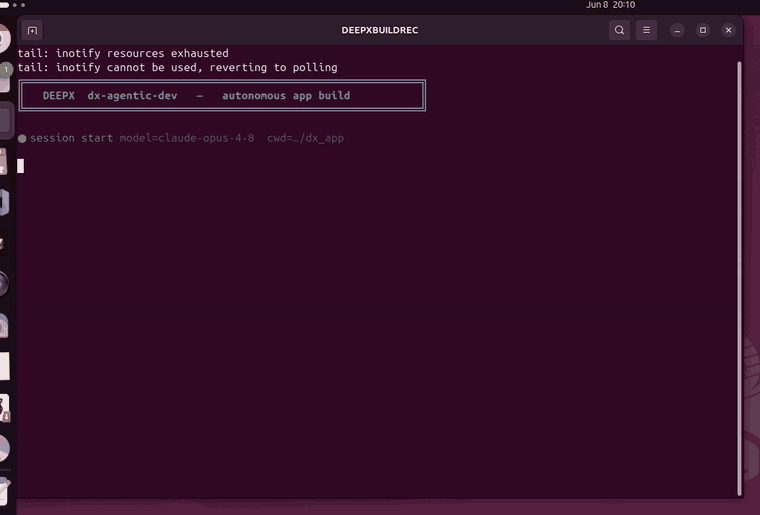

# Stretch Coach — Arcade Stretching Mini-Game (yolo26n-pose · DX-M1 NPU)

> **The story.** From a single natural-language prompt, dx-agent-dev builds a complete
> on-device **arcade stretching game**: `yolo26n-pose` COCO-17 keypoints run on the DEEPX
> **DX-M1 NPU**, guiding the player through **3 stretches** (overhead reach → forward fold →
> neck stretch) with a HOLD-to-advance loop and GOOD!/CLEAR! feedback.
>
> **What's new in this build:** the top-left "coach" is now a **filled, person-like
> humanoid avatar** — a round head, a filled torso/pelvis, and tapered limb capsules with
> shaded joints — instead of a thin stick-figure skeleton, so it reads as a real coach
> demonstrating the move.

<div align="center"><table><tr>
<td align="center"><br><sub><b>gameplay — filled humanoid coach (top-left) + live NPU pose tracking</b></sub></td>
<td align="center"><br><sub><b>dx-agent-dev building it (timelapse)</b></sub></td>
</tr></table></div>

> **See how the agent built it:** [`claude-code-session.md`](./claude-code-session.md).

### Session metrics

| Metric | Value |
|--------|-------|
| Coding agent / model | **Claude Code** / **Claude Opus 4.8** (`claude-opus-4-8`) |
| Human input | **1 natural-language prompt** — fully autonomous |
| Skills | `dx-skill-router` → `dx-agent-brainstorm` → `dx-swe-writing-plans` → `dx-agent-tdd` → `dx-agent-verify` |
| Wall-clock / turns / cost | ~17 min / 148 / ≈ $9.3 |

## The prompt

The avatar requirement is the only thing that changed from a plain stick-figure game — the
prompt asks for a **filled procedural humanoid** built from the pose keypoints:

```
Using the yolo26n-pose model on the DEEPX NPU, build a simple arcade-style stretching
mini-game ... For each stage, render a small "coach" avatar that demonstrates the current
target stretch. IMPORTANT — the coach must look like a REAL PERSON, not a stick figure:
draw it as a FILLED, PROCEDURAL HUMANOID built from the pose keypoints — a round head, a
filled torso/pelvis body, and tapered LIMB CAPSULES (filled rounded segments for
upper-arm/forearm and thigh/shin) with smooth filled joints ... Do NOT draw it as thin
stick-figure lines or a bare keypoint skeleton. Animate the coach ... Recognize each pose
from the player's keypoints ... HOLD to advance, CLEAR! when all three are done. Support
both --video <file> and --camera <id>; save an annotated output video.
```

## The game

| Stage | Stretch | Recognised from keypoints |
|------:|---------|---------------------------|
| 1/3 | **OVERHEAD REACH** | both wrists above the head |
| 2/3 | **FORWARD FOLD** | head/shoulders drop toward the hips (torso folds) |
| 3/3 | **NECK STRETCH** | one hand raised beside the head, other arm low |

Hold the matching pose ~1.2 s → **GOOD!** + advance; finish all three → **CLEAR!**
On-screen: STAGE n/3, the animated **humanoid coach** (top-left), stretch name + instruction,
a HOLD progress bar, your live skeleton, and a model · NPU · FPS status line.

## Architecture

Standard dx_app pose pipeline — `StretchPoseFactory` (`IPoseFactory`, reusing Letterbox +
YOLOv8Pose post-process) + `SyncRunner`. The game core (`game/stretch_game.py`) adds
`PoseClassifier`, the `HumanoidCoach` renderer (`cv2.fillConvexPoly` torso + tapered limb
capsules), and the `StretchGame` state machine + arcade overlay.

## Reproduce

```bash
bash setup.sh        # venv (dx-runtime) + GUI OpenCV + vendor framework
bash run.sh          # runs the bundled demo video → annotated output/<run>/output.mp4
bash run.sh --camera 0          # live camera
bash run.sh --video clip.mp4    # any video
```

> x86-64 Linux + DeepX DX-M1 runtime (`yolo26n-pose.dxnn`). Self-contained: `common/` is
> vendored and `sample/stretching_demo.mp4` is bundled; the app runs once moved out of the suite.

## Files

| File | Purpose |
|------|---------|
| `yolo26n_pose_stretch_sync.py` | Entry — `StretchPoseFactory` + `SyncRunner` |
| `factory/` | `IPoseFactory` (Letterbox + YOLOv8Pose) + game visualizer |
| `game/stretch_game.py` | `PoseClassifier`, **`HumanoidCoach`** (filled-humanoid renderer), `StretchGame` |
| `config.json` | pose thresholds + hold timing (calibrated from the demo) |
| `calibrate.py` / `verify.py` | metric probe / headless validation (asserts CLEAR! + saves video) |
| `setup.sh` / `run.sh` | relocatable setup / one-command launcher |
| `sample/stretching_demo.mp4` | bundled demo input |
| `claude-code-session.md` | full agent build transcript (Wall-clock + Cost) |

Korean: [`README-ko.md`](./README-ko.md).
