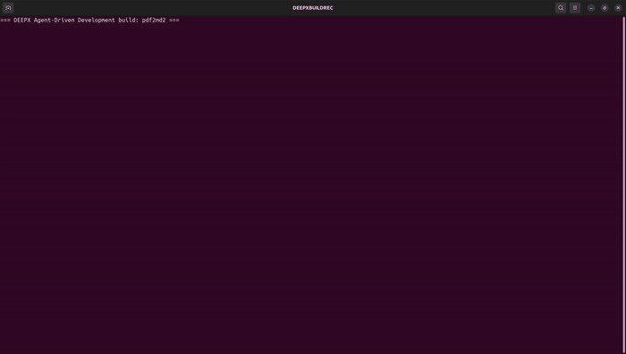
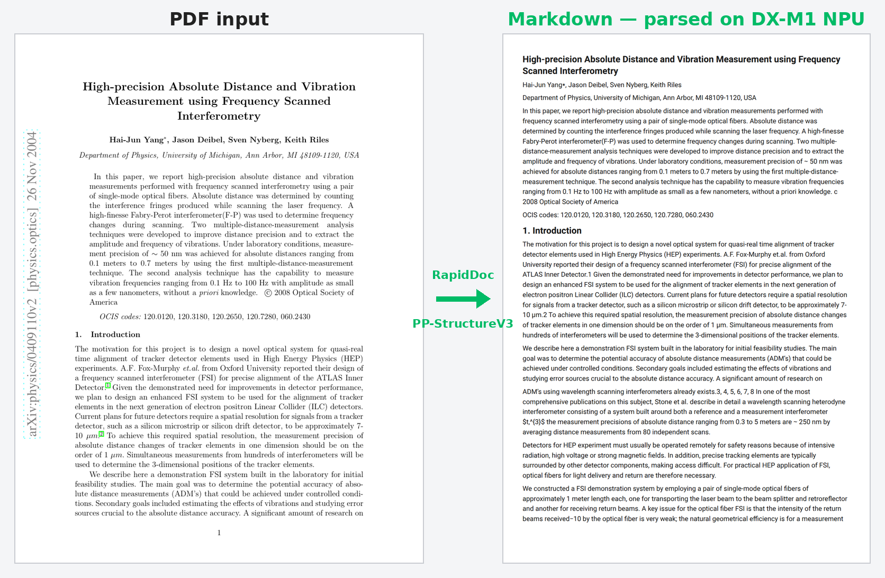

# DEEPX DX-M1 NPU에서 PDF → Markdown 변환 (RapidDoc / PP-StructureV3)

> **스토리.** 사용자가 **짧고 목표만 담은 프롬프트** — "DEEPX NPU에서 동작하는 PDF→Markdown
> 앱을 만들어줘" — 를 입력합니다. **toolset도, 파일도, repo 브랜치도, env script도 적지
> 않습니다.** 그것만으로 dx-agent-dev는 알맞은 knowledge base로 routing하고, DEEPX
> **RapidDoc** fork를 clone하고, NPU 모델을 provisioning한 뒤, PDF(디지털 또는 스캔)를
> 구조화된 **Markdown + JSON**으로 변환하는 동작하는 앱을 만들어냅니다 — **layout 분석, OCR,
> 표/수식 인식을 모두 DX-M1 NPU에서** 실행 (PP-StructureV3).

<div align="center"><table><tr>
<td align="center"><br><sub><b>dx-agent-dev가 이 showcase를 빌드하는 과정 (타임랩스)</b></sub></td>
<td align="center"><br><sub><b>PDF 페이지 → Markdown, DX-M1 NPU에서 파싱</b></sub></td>
</tr></table></div>

> **에이전트가 어떻게 만들었는지 보기:** [`claude-code-session.md`](./claude-code-session.md).

### Session 메트릭

| 항목 | 값 |
|--------|-------|
| Coding agent / model | **Claude Code** / **Claude Opus 4.8** (`claude-opus-4-8`) |
| 사람 입력 | **짧은 자연어 프롬프트 1개** — 완전 자율 |
| 읽은 KB toolset | `paddleocr-rapiddoc-app` — 프롬프트에 적지 않았으나 **routing으로 스스로 찾음** |
| Skills | `dx-skill-router` → `dx-agent-brainstorm` → `dx-swe-writing-plans` → `dx-agent-tdd` → `dx-agent-verify` |
| Wall-clock / turns / cost | ~17분 / 109 / ≈ $14.3 |

## 프롬프트

이 showcase의 핵심: 프롬프트는 **간결**하며 toolset 경로·파일·브랜치·env script를 적지
않습니다 — 그 부분은 skill + KB routing이 채웁니다.

```
Build a PDF-to-Markdown app whose document-parsing pipeline (layout analysis + OCR +
table/formula recognition) runs on the DEEPX DX-M1 NPU. Input a PDF (digital or scanned),
output structured Markdown (+ JSON) preserving headings and tables. Support
--parse-method auto|txt|ocr. Provide setup.sh, run.sh, a sample input PDF + its rendered
Markdown output (sample_output.md), and a README reporting NPU stage timings.
```

> **아키텍처 노트.** RapidDoc는 *자체* NPU pipeline을 제공합니다(PP-StructureV3 모델이 fork
> runtime을 통해 DX-M1에서 실행). dx_app knowledge base(`paddleocr-rapiddoc-app.md`)에 따르면
> 이는 IFactory / SyncRunner 패턴의 문서화된 **예외**입니다 — 앱은 fork의 pipeline을 구동하는
> 얇은 standalone launcher이며, 단일 `.dxnn`을 factory로 감싸지 않습니다.

## 빠른 시작

```bash
./setup.sh                          # fork clone + venv + deps + NPU 모델 다운로드 (foreground, 1회)
./run.sh                            # sample_input.pdf를 --parse-method auto(기본)로 파싱
./run.sh --parse-method ocr         # 전체 페이지 강제 OCR (스캔 문서)
./run.sh --parse-method txt         # text layer만 사용 (빠름, 디지털 PDF)
./run.sh --input my.pdf --parse-method auto
```

출력은 `output-<method>/<doc>/<method>/`에 생성되며, 렌더된 Markdown은 `./sample_output.md`,
단계별 NPU 처리시간 리포트는 `./timings.md`로 복사됩니다.

## `--parse-method`

| Method | 동작 | 용도 |
|---|---|---|
| `auto` *(기본)* | PDF text layer를 먼저 시도, region별로 NPU OCR로 fallback | 혼합/미상 PDF |
| `txt`  | 내장 text layer만 사용 (OCR 없음) | born-digital PDF (가장 빠름) |
| `ocr`  | 모든 페이지에 NPU에서 전체 OCR(PP-OCRv5 det+rec) 강제 | 스캔/이미지 PDF |

## On-device pipeline (DX-M1)

`--finegrained`(기본)는 7-stage streaming pipeline을 실행합니다. Engine 배치:

| Stage | Engine | Device |
|---|---|---|
| Layout 분석 (`pp_doclayout_l`) | dxengine | **NPU** |
| OCR detection (`ch_PP-OCRv5_server_det`) | dxengine | **NPU** |
| OCR recognition (`ch_PP-OCRv5_rec_server`) | dxengine | **NPU** |
| Table recognition (`unet` + structure) | dxengine | **NPU** |
| Formula recognition (`pp_formulanet_plus_l`) | onnxruntime | CPU |

16개의 `.dxnn` 모델이 `setup.sh`에 의해 `RapidDoc/dxnn_models/`로 provisioning됩니다.

## 측정된 NPU 성능

이번 session의 실제 수치 — `sample_input.pdf` = `physics0409110_origin.pdf`
(영문 물리 논문, *"High-precision Absolute Distance and Vibration Measurement using
Frequency Scanned Interferometry"*, **16페이지**, 수식 위주), DX-M1, `DXNN_DEVICES=0`,
runtime 3.3.2 / FW v2.5.6. `session.log` / `timings.md`에 기록됨.

**end-to-end (auto, 16페이지): 36.9 s** wall, 0.4 pages/s. NPU 단계별:

| Stage | Count | 평균 latency | Throughput | 비중 |
|---|---:|---:|---:|---:|
| Formula recognition | 164 | 201.21 ms | 5.0 FPS | 84.5% |
| Layout analysis | 16 | 311.62 ms | 3.2 FPS | 12.8% |
| Table recognition | 1 | 795.29 ms | 1.3 FPS | 2.0% |
| PDF-det / OCR-det | 100 | ~2 ms | — | 0.7% |

이 논문은 **수식이 많은** 문서로, 164개 수식 region이 84.5%를 차지해 pipeline의
**formula recognition**(+ layout/OCR)을 잘 보여줍니다. 1회성 model load 1.75 s.
(`txt`는 PDF text layer를 재사용해 더 빠르고, `ocr`은 전체 페이지 OCR을 강제해 더 느립니다.)

## 샘플 출력 (`sample_output.md` 발췌)

제목·저자·abstract·섹션 제목이 보존되며, 수식은 formula region으로 인식됩니다
(Markdown에서는 잘린 이미지로 렌더):

```markdown
# High-precision Absolute Distance and Vibration Measurement using Frequency Scanned Interferometry

Hai-Jun Yang, Jason Deibel, Sven Nyberg, Keith Riles

Department of Physics, University of Michigan, Ann Arbor, MI 48109-1120, USA

In this paper, we report high-precision absolute distance and vibration measurements
performed with frequency scanned interferometry using a pair of single-mode optical fibers...

# 1. Introduction
# 2. Principles
# 3. Demonstration System of FSI
```

## 재현

```bash
bash setup.sh        # DEEPX-AI/RapidDoc@rapid_doc_deepx를 fresh clone + venv + deps + foreground 모델 다운로드
bash run.sh          # sample_input.pdf를 NPU에서 파싱 → sample_output.md + timings.md
```

> x86-64 Linux + DeepX runtime 필요; `dx_engine` 없으면: `cd dx-runtime && bash install.sh --all --exclude-app --exclude-stream`.
> 모델은 fork의 `./setup.sh`(prebuilt `onnx_models/` + `dxnn_models/`)로 받으며 `dxcom`으로 직접
> 컴파일하지 않습니다. fork는 이 디렉터리에 fresh clone되며(output isolation), 기존 사용자 repo를
> 재사용하거나 삭제하지 않습니다.

영어: [`README.md`](./README.md).
