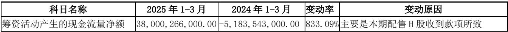

# PDF → Markdown on the DEEPX DX-M1 NPU (RapidDoc / PP-StructureV3)

> **The story.** A user types a **short, goal-only prompt** — "build a PDF→Markdown app
> that runs on the DEEPX NPU" — naming **no toolset, no file, no repo branch, no env
> script.** From that alone, dx-agent-dev routes to the right knowledge base, clones the
> DEEPX **RapidDoc** fork, provisions the NPU models, and produces a working app that turns
> a PDF (digital or scanned) into structured **Markdown + JSON** — **layout analysis, OCR,
> and table/formula recognition all on the DX-M1 NPU** (PP-StructureV3).

<div align="center"><table><tr>
<td align="center"><br><sub><b>dx-agent-dev building this showcase (timelapse)</b></sub></td>
<td align="center"><br><sub><b>a financial table recognized on the DX-M1 NPU</b></sub></td>
</tr></table></div>

> **See how the agent built it:** [`claude-code-session.md`](./claude-code-session.md).

### Session metrics

| Metric | Value |
|--------|-------|
| Coding agent / model | **Claude Code** / **Claude Opus 4.8** (`claude-opus-4-8`) |
| Human input | **1 short natural-language prompt** — fully autonomous |
| KB toolsets read | `paddleocr-rapiddoc-app` — **discovered via routing**, not named in the prompt |
| Skills | `dx-skill-router` → `dx-agent-brainstorm` → `dx-swe-writing-plans` → `dx-agent-tdd` → `dx-agent-verify` |
| Wall-clock / turns / cost | ~17 min / 109 / ≈ $14.3 |

## The prompt

The whole point of this showcase: the prompt is **concise** and names no toolset path,
file, branch, or env script — the skill + KB routing supply all of that.

```
Build a PDF-to-Markdown app whose document-parsing pipeline (layout analysis + OCR +
table/formula recognition) runs on the DEEPX DX-M1 NPU. Input a PDF (digital or scanned),
output structured Markdown (+ JSON) preserving headings and tables. Support
--parse-method auto|txt|ocr. Provide setup.sh, run.sh, a sample input PDF + its rendered
Markdown output (sample_output.md), and a README reporting NPU stage timings.
```

> **Architecture note.** RapidDoc ships its *own* NPU pipeline (the PP-StructureV3 models
> run on the DX-M1 through the fork's runtime). Per the dx_app knowledge base
> (`paddleocr-rapiddoc-app.md`) this is the documented **exception** to the IFactory /
> SyncRunner pattern: the app is a thin standalone launcher that drives the fork's
> pipeline — it does not wrap a single `.dxnn` in a factory.

## Quick start

```bash
./setup.sh                          # clone fork + venv + deps + download NPU models (foreground, one-shot)
./run.sh                            # parse sample_input.pdf with --parse-method auto (default)
./run.sh --parse-method ocr         # force full-page OCR (scanned docs)
./run.sh --parse-method txt         # text-layer only (fast, digital PDFs)
./run.sh --input my.pdf --parse-method auto
```

Outputs land in `output-<method>/<doc>/<method>/`; the rendered Markdown is copied to
`./sample_output.md` and the per-stage NPU timing report to `./timings.md`.

## `--parse-method`

| Method | Behavior | Use for |
|---|---|---|
| `auto` *(default)* | Try the PDF text layer first, fall back to NPU OCR per region | Mixed / unknown PDFs |
| `txt`  | Use the embedded text layer only (no OCR) | Born-digital PDFs (fastest) |
| `ocr`  | Force full-page OCR (PP-OCRv5 det+rec) on the NPU for every page | Scanned / image-only PDFs |

## On-device pipeline (DX-M1)

`--finegrained` (default) runs a 7-stage streaming pipeline. Engine assignment:

| Stage | Engine | Device |
|---|---|---|
| Layout analysis (`pp_doclayout_l`) | dxengine | **NPU** |
| OCR detection (`ch_PP-OCRv5_server_det`) | dxengine | **NPU** |
| OCR recognition (`ch_PP-OCRv5_rec_server`) | dxengine | **NPU** |
| Table recognition (`unet` + structure) | dxengine | **NPU** |
| Formula recognition (`pp_formulanet_plus_l`) | onnxruntime | CPU |

16 `.dxnn` models are provisioned by `setup.sh` into `RapidDoc/dxnn_models/`.

## Measured NPU performance

Real numbers from this session — `sample_input.pdf` = `比亚迪财报_origin.pdf`
(BYD 2025 Q1 report, **9 pages**, 21 headings, 9 tables), DX-M1, `DXNN_DEVICES=0`,
runtime 3.3.2 / FW v2.5.6. Captured in `session.log` / `timings.md`.

**End-to-end by parse-method (9 pages):**

| Method | Total time | Throughput | Avg/page | Headings | Tables |
|---|---:|---:|---:|---:|---:|
| `txt`  | 9.5 s  | 0.9 pages/s | 1.29 s | 21 | 9 |
| `auto` | 9.7 s  | 0.9 pages/s | 1.31 s | 21 | 9 |
| `ocr`  | 12.3 s | 0.7 pages/s | 2.19 s | 17 | 9 |

(`ocr` is slower because it forces PP-OCRv5 det+rec on every page instead of reusing
the PDF text layer.) Per-stage breakdown (auto): Layout 289.51 ms/page (NPU, 22%),
Table 703.03 ms/region (NPU, 78%); one-time model load 1.74 s.

## Sample output (excerpt from `sample_output.md`)

Headings and a financial table are preserved verbatim (HTML table markup, the
PP-StructureV3 convention; rowspan/colspan retained):

```markdown
# 比亚迪股份有限公司
# 2025 年第一季度报告
# 一、主要财务数据

<table><tr><td></td><td>本报告期</td><td>上年同期</td><td>本报告期比上年同期增减（%）</td></tr>
<tr><td>营业收入（元）</td><td>170,360,448,000.00</td><td>124,944,397,000.00</td><td>36.35%</td></tr>
<tr><td>归属于上市公司股东的净利润（元）</td><td>9,154,985,000.00</td><td>4,568,793,000.00</td><td>100.38%</td></tr>
...
```

## Reproduce

```bash
bash setup.sh        # clone DEEPX-AI/RapidDoc@rapid_doc_deepx fresh + venv + deps + foreground model download
bash run.sh          # parse sample_input.pdf on the NPU → sample_output.md + timings.md
```

> x86-64 Linux + DeepX runtime; `dx_engine` missing: `cd dx-runtime && bash install.sh --all --exclude-app --exclude-stream`.
> Models come from the fork's `./setup.sh` (prebuilt `onnx_models/` + `dxnn_models/`) —
> **not** hand-compiled with `dxcom`. The fork is cloned fresh into this dir (output
> isolation); no pre-existing user repo is reused or deleted.

## Files

| File | Purpose |
|---|---|
| `setup.sh` | Clone fork + venv + deps + foreground model download + pick sample PDF |
| `run.sh` | One-command launcher: venv + DX-RT env + `DXNN_DEVICES` + `--parse-method` |
| `sample_input.pdf` | Sample input (BYD 2025 Q1 report, 9 pages) |
| `sample_output.md` | Rendered Markdown (auto) — headings + 9 tables preserved |
| `images/sample_table_region.jpg` | A table region recognized on the NPU (referenced by `sample_output.md`) |
| `timings.md` | Per-stage NPU timing report (from the real run) |
| `session.log` | Captured real command output (setup + all runs) |
| `claude-code-session.md` | Full agent build transcript (Wall-clock + Cost) |

Korean: [`README-ko.md`](./README-ko.md).
