# High-precision Absolute Distance and Vibration Measurement using Frequency Scanned Interferometry

Hai-Jun Yang∗, Jason Deibel, Sven Nyberg, Keith Riles

Department of Physics, University of Michigan, Ann Arbor, MI 48109-1120, USA

In this paper, we report high-precision absolute distance and vibration measurements performed with frequency scanned interferometry using a pair of single-mode optical fibers. Absolute distance was determined by counting the interference fringes produced while scanning the laser frequency. A high-finesse Fabry-Perot interferometer(F-P) was used to determine frequency changes during scanning. Two multiple-distance-measurement analysis techniques were developed to improve distance precision and to extract the amplitude and frequency of vibrations. Under laboratory conditions, measurement precision of ∼ 50 nm was achieved for absolute distances ranging from 0.1 meters to 0.7 meters by using the first multiple-distance-measurement technique. The second analysis technique has the capability to measure vibration frequencies ranging from 0.1 Hz to 100 Hz with amplitude as small as a few nanometers, without a priori knowledge. c 2008 Optical Society of America

OCIS codes: 120.0120, 120.3180, 120.2650, 120.7280, 060.2430

# 1. Introduction

The motivation for this project is to design a novel optical system for quasi-real time alignment of tracker detector elements used in High Energy Physics (HEP) experiments. A.F. Fox-Murphy et.al. from Oxford University reported their design of a frequency scanned interferometer (FSI) for precise alignment of the ATLAS Inner Detector.1 Given the demonstrated need for improvements in detector performance, we plan to design an enhanced FSI system to be used for the alignment of tracker elements in the next generation of electron positron Linear Collider (ILC) detectors. Current plans for future detectors require a spatial resolution for signals from a tracker detector, such as a silicon microstrip or silicon drift detector, to be approximately 7- 10 µm.2 To achieve this required spatial resolution, the measurement precision of absolute distance changes of tracker elements in one dimension should be on the order of 1 µm. Simultaneous measurements from hundreds of interferometers will be used to determine the 3-dimensional positions of the tracker elements.

We describe here a demonstration FSI system built in the laboratory for initial feasibility studies. The main goal was to determine the potential accuracy of absolute distance measurements (ADM’s) that could be achieved under controlled conditions. Secondary goals included estimating the effects of vibrations and studying error sources crucial to the absolute distance accuracy. A significant amount of research on

ADM’s using wavelength scanning interferometers already exists.3, 4, 5, 6, 7, 8 In one of the most comprehensive publications on this subject, Stone et al. describe in detail a wavelength scanning heterodyne interferometer consisting of a system built around both a reference and a measurement interferometer $t,^{3}$ the measurement precisions of absolute distance ranging from 0.3 to 5 meters are ∼ 250 nm by averaging distance measurements from 80 independent scans.

Detectors for HEP experiment must usually be operated remotely for safety reasons because of intensive radiation, high voltage or strong magnetic fields. In addition, precise tracking elements are typically surrounded by other detector components, making access difficult. For practical HEP application of FSI, optical fibers for light delivery and return are therefore necessary.

We constructed a FSI demonstration system by employing a pair of single-mode optical fibers of approximately 1 meter length each, one for transporting the laser beam to the beam splitter and retroreflector and another for receiving return beams. A key issue for the optical fiber FSI is that the intensity of the return beams received−10 by the optical fiber is very weak; the natural geometrical efficiency is for a measurement distance of 0.5 meter. In our design, we use a gradient index lens (GRIN lens) to collimate the output beam from the optical fiber.

We believe our work represents a significant advancement in the field of FSI in that high-precision ADM’s and vibration measurements are performed (without a priori knowledge of vibration strengths and frequencies), using a tunable laser, an isolator, an off-the-shelf F-P, a fiber coupler, two single-mode optical fibers, an interferometer and novel fringe analysis and vibration extraction techniques. Two new multiple-distance-measurement analysis techniques are presented, to improve precision and to extract the amplitude and frequency of vibrations. Expected dispersion effects when a corner cube prism or a beamsplitter substrate lies in the interferometer beam path are confirmed, and observed results agree well with results from numerical simulation. When present, the dispersion effect has a significant impact on the absolute distance measurement. The limitations of our current FSI system are also discussed in the paper, and major uncertainties are estimated.

# 2. Principles

The intensity I of any two-beam interferometer can be expressed as

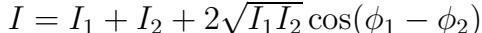

where $I_{1}$ and $I_{2}$ are the intensities of the two combined beams, $\phi_{1}$ and φ2 are the phases. Assuming the optical path lengths of the two beams are $L_{1}$ and $L_{2}$ , the phase difference in Eq. (1) is $\Phi=\phi_{1}-\phi_{2}=2\pi|L_{1}-L_{2}|(\nu/c)$ , where ν is the optical frequency of the laser beam, and c is the speed of light.

For a fixed path interferometer, as the frequency of the laser is continuously scanned, the optical beams will constructively and destructively interfere, causing “fringes”. The number of fringes ∆N is

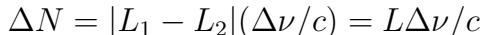

where L is the optical path difference between the two beams, and $\Delta\nu$ is the scanned frequency range. The optical path difference (OPD for absolute distance between beamsplitter and retroreflector) can be determined by counting interference fringes while scanning the laser frequency.

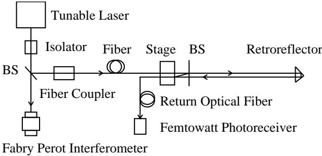  
Fig. 1. Schematic of an optical fiber FSI system.

# 3. Demonstration System of FSI

A schematic of the FSI system with a pair of optical fibers is shown in Fig.1. The light source is a New Focus Velocity 6308 tunable laser $\left(665.1nm<\lambda<675.2nm\right)$ . A high-finesse (> 200) Thorlabs SA200 F-P is used to measure the frequency range scanned by the laser. The free spectral range (FSR) of two adjacent F-P peaks is 1.5 GHz, which corresponds to 0.002 nm. A Faraday Isolator was used to reject light reflected back into the lasing cavity. The laser beam was coupled into a single-mode optical fiber with a fiber coupler. Data acquisition is based on a National Instruments DAQ card capable of simultaneously sampling 4 channels at a rate of 5 $\mathrm{M S/s/}$ ch with a precision of 12-bits. Omega thermistors with a tolerance of 0.02 K and a precision of 0.01 mK are used to monitor temperature. The apparatus is supported on a damped Newport optical table.

In order to reduce air flow and temperature fluctuations, a transparent plastic box was constructed on top of the optical table. PVC pipes were installed to shield the volume of air surrounding the laser beam. Inside the PVC pipes, the typical standard deviation of 20 temperature measurements was about 0.5 mK. Temperature fluctuations were suppressed by a factor of approximately 100 by employing the plastic box and PVC pipes.

The beam intensity coupled into the return optical fiber is very weak, requiring ultra-sensitive photodetectors for detection. Considering the limited laser beam intensity and the need to split into many beams to serve a set of interferometers, it is vital to increase the geometrical efficiency. To this end, a collimator is built by placing an optical fiber in a ferrule (1mm diameter) and gluing one end of the optical fiber to a GRIN lens. The GRIN lens is a 0.25 pitch lens with 0.46 numerical aperture, 1 mm diameter and 2.58 mm length which is optimized for a wavelength of 630nm. The density of the outgoing beam from the optical fiber is increased by a factor of approximately 1000 by using a GRIN lens. The return beams are received by another optical fiber and amplified by a Si femtowatt photoreceiver with a gain of $2\times10^{10}V/A$

# 4. Multiple-Distance-Measurement Techniques

For a FSI system, drifts and vibrations occurring along the optical path during the scan will be magnified by a factor of $\Omega\;=\;\nu/\Delta\nu$ , where ν is the average optical frequency of the laser beam and $\Delta\nu$ is the scanned frequency. For the full scan of our laser, $\Omega\sim67$ . Small vibrations and drift errors that have negligible effects for many optical applications may have a significant impact on a FSI system. A singlefrequency vibration may be expressed as $x_{\mathit{v i b}}(t)=a_{\mathit{v i b}}\cos(2\pi f_{\mathit{v i b}}t+\phi_{\mathit{v i b}})$ , where $a_{v i b}$ , $f_{v i b}$ and $\phi_{v i b}$ are the amplitude, frequency and phase of the vibration respectively. If $t_{0}$ is the start time of the scan, Eq. (2) can be re-written as

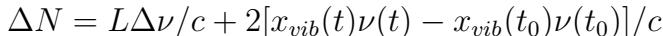

If we approximate $\nu(t)\sim\nu(t_{0})=\nu,$ the measured optical path difference $L_{m e a s}$ may be expressed as

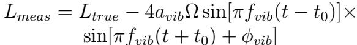

where $L_{t r u e}$ is the true optical path difference without vibration effects. If the pathaveraged refractive index of ambient air $\bar{n}_{g}$ is known, the measured distance is $R_{m e a s}=$ $L_{m e a s}/(2\bar{n}_{g})$ .

If the measurement window size $(t-t_{0})$ is fixed and the window used to measure a set of $R_{m e a s}$ is sequentially shifted, the effects of the vibration will be evident. We use a set of distance measurements in one scan by successively shifting the fixed-length measurement window one F-P peak forward each time. The arithmetic average of all measured $R_{m e a s}$ values in one scan is taken to be the measured distance of the scan (although more sophisticated fitting methods can be used to extract the central value). For a large number of distance measurements $N_{m e a s}.$ , the vibration effects can be greatly suppressed. Of course, statistical uncertainties from fringe and frequency determination, dominant in our current system, can also be reduced with multiple scans. Averaging multiple measurements in one scan, however, provides similar precision improvement as averaging distance measurements from independent scans, and is faster, more efficient, and less susceptible to systematic errors from drift. In this way, we can improve the distance accuracy dramatically if there are no significant drift errors during one scan, caused, for example, by temperature variation. This multipledistance-measurement technique is called ’slip measurement window with fixed size’, shown in Fig.2. However, there is a trade off in that the thermal drift error is increased with the increase of $N_{m e a s}$ because of the larger magnification factor Ω for a smaller measurement window size.

In order to extract the amplitude and frequency of the vibration, another multipledistance-measurement technique called ’slip measurement window with fixed start point’ is shown in Fig.2. In Eq. (3), if $t_{0}$ is fixed, the measurement window size is enlarged one F-P peak for each shift, an oscillation of a set of measured $R_{m e a s}$ values reflects the amplitude and frequency of vibration. This technique is not suitable for

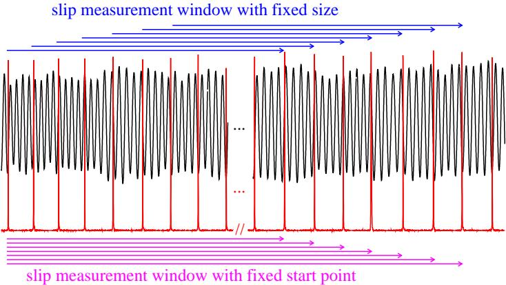  
Fig. 2. The schematic of two multiple-distance-measurement techniques. The interference fringes from the femtowatt photoreceiver and the scanning frequency peaks from the Fabry-Perot interferometer(F-P) for the optical fiber FSI system recorded simultaneously by DAQ card are shown in black and red, respectively. The free spectral range(FSR) of two adjacent F-P peaks (1.5 GHz) provides a calibration of the scanned frequency range.

distance measurement because there always exists an initial bias term including $t_{0}$ which cannot be determined accurately in our current system.

# 5. Absolute Distance Measurement

The typical measurement residual versus the distance measurement number in one scan using the above technique is shown in $\mathrm{F i g.3(a)}$ , where the scanning rate was 0.5 nm/s and the sampling rate was 125 $\mathrm{k S/s}$ . Measured distances minus their average value for 10 sequential scans are plotted versus number of measurements $\left(N_{m e a s}\right)$ per scan in Fig.3(b). The standard deviations (RMS) of distance measurements for 10 sequential scans are plotted versus number of measurements $\left(N_{m e a s}\right)$ per scan in $\mathrm{F i g.3(c)}$ . It can be seen that the distance errors decrease with an increase of $N_{m e a s}.$ . The RMS of measured distances for 10 sequential scans is 1.6 µm if there is only one distance measurement per scan $(N_{\mathit{m e a s}}=1).\mathrm{~I f~}N_{\mathit{m e a s}}=1200$ and the average value of 1200 distance measurements in each scan is considered as the final measured distance of the scan, the RMS of the final measured distances for 10 scans is 41 nm for the distance of 449828.965 $\mu m$ , the relative distance measurement precision is 91 ppb.

Some typical measurement residuals are plotted versus the number of distance measurements in one $\mathrm{s c a n}(N_{m e a s})$ for open box and closed box data with scanning rates of 2 nm/s and 0.5 nm/s in Fig. $4(\mathrm{a,}\mathrm{b,}\mathrm{c,}\mathrm{d})$ , respectively. The measured distance is approximately 10.4 cm. It can be seen that the slow fluctuations of multiple distance measurements for open box data are larger than that for closed box data.

The standard deviation (RMS) of measured distances for 10 sequential scans is approximately 1.5 µm if there is only one distance measurement per scan for closed

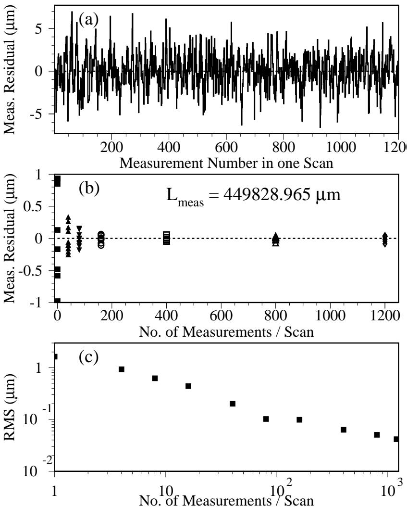  
Fig. 3. Distance measurement residual spreads versus number of distance measurement Nmeas (a) for one typical scan, (b) for 10 sequential scans, (c) is the standard deviation of distance measurements for 10 sequential scans versus Nmeas.

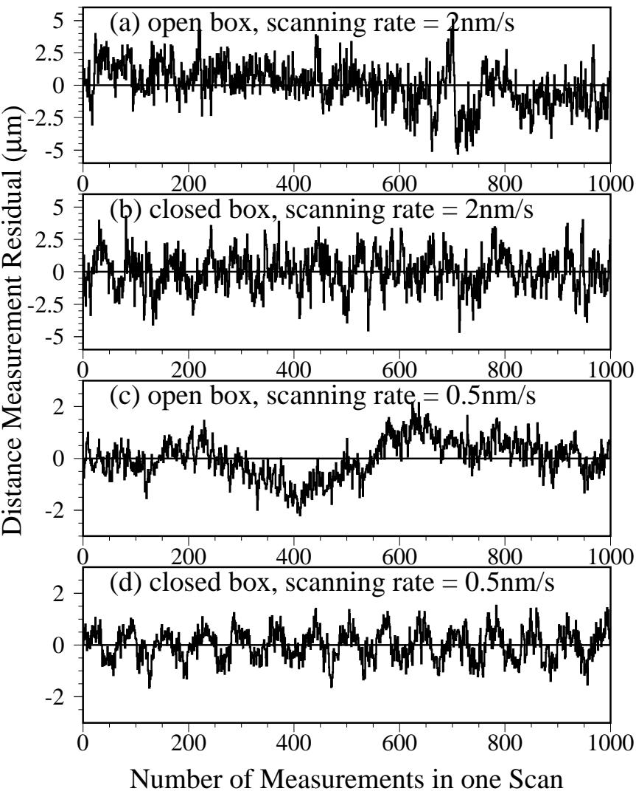  
Fig. 4. Distance measurement residual spreads versus Nmeas in one scan; (a) for the open box with a scanning rate of 2 nm/s, (b) for the closed box with a scanning rate of 2 nm/s, (c) for the open box with a scanning rate of 0.5 nm/s, (d) for the closed box with a scanning rate of 0.5 nm/s.

box data. By using multiple-distance-measurement technique, the distance measurement precisions for various closed box data with distances ranging from 10 cm to 70 cm collected in the past year are improved significantly, precisions of approximately 50 nanometers are demonstrated under laboratory conditions, as shown in Table 1. All measured precisions listed in the Table 1. are the RMS of measured distances for 10 sequential scans. Two FSI demonstration systems, ’air FSI’ and ’optical fiber FSI’, are constructed for extensive tests of multiple-distance-measurement technique, ’air FSI’ means FSI with the laser beam transported entirely in the ambient atmosphere, ’optical fiber FSI’ represents FSI with the laser beam delivered to the interferometer and received back by single-mode optical fibers.

Table 1. Distance measurement precisions for various setups using the multipledistance-measurement technique.   
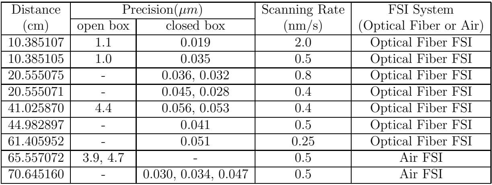

Based on our studies, the slow fluctuations are reduced to a negligible level by using the plastic box and PVC pipes to suppress temperature fluctuations. The dominant error comes from the uncertainties of the interference fringes number determination; the fringes uncertainties are uncorrelated for multiple distance measurements. In this case, averaging multiple distance measurements in one scan provides a similar precision improvement to averaging distance measurements from multiple independent scans, but is faster, more efficient and less susceptible to systematic errors from drift. But, for open box data, the slow fluctuations are dominant, on the order of few microns in our laboratory. The measurement precisions for single and multiple distance open-box measurements are comparable, which indicates that the slow fluctuations cannot be adequately suppressed by using the multiple-distance-measurement technique. A dual-laser FSI system6, 9 intended to cancel the drift error is currently under study in our laboratory (to be described in a subsequent article).

From Fig.4(d), we observe periodic oscillation of the distance measurement residuals in one scan, the fitted frequency is 3.22 ± 0.01 Hz for the scan. The frequency depends on the scanning rate, $f\sim$ (scanning rate in $n m/s){\times}60/(675.1n m{-}665.1n m)$ . From Eq.(4), it is clear that the amplitude of the vibration or oscillation pattern for multiple distance measurements depends on $4a_{v i b}\Omega\sin[\pi f_{v i b}(t-t_{0})]$ . If $a_{v i b},\;f_{v i b}$ are constant values, it depends on the size of the distance measurement window. Subsequent investigation with a CCD camera trained on the laser output revealed that the apparent ${\sim}3$ Hz vibration during the 0.5 nm/s scan arose from the beam’s centroid motion. Because the centroid motion is highly reproducible, we believe that the effect comes from motion of the internal hinged mirror in the laser used to scan its frequency.

The measurable distance range is limited in our current optical fiber FSI demonstration system for several reasons. For a given scanning rate of 0.25 nm $1/\mathrm{s},$ the produced interference fringes, estimated by $\Delta N\sim(2\times\Delta L\times\Delta\nu)/c$ , are approximately 26400 in a 40-second scan for a measured distance $(\Delta L)$ of 60 cm, that is ∼ 660 fringes/s, where $\Delta\nu$ is the scanned frequency and c is the speed of light. The currently used femtowatt photoreceiver has 3 dB frequency bandwidth ranging from 30-750 Hz, the transimpedance gain decreases quickly beyond 750 Hz. There are two ways to extend the measurable distance range. One straightforward way is to extend the effective frequency bandwidth of the femtowatt photoreceiver; the other way is to decrease the interference fringe rate by decreasing the laser scanning rate. There are two major drawbacks for the second way; one is that larger slow fluctuations occur during longer scanning times; the other is that the laser scanning is not stable enough to produce reliable interference fringes if the scanning rate is lower than 0.25 nm/s for our present tunable laser. In addition, another limitation to distance range is that the intensity of the return beam from the retroreflector decreases inverse-quadratically with range.

# 6. Vibration Measurement

In order to test the vibration measurement technique, a piezoelectric transducer (PZT) was employed to produce vibrations of the retroreflector. For instance, the frequency of the controlled vibration source was set to $1.01\pm0.01$ Hz with amplitude of $[0.14\pm0.02\;\mu m.\;\mathrm{F o r}\;N_{m e a s}=2000$ distance measurements in one scan, the magnification factor for each distance measurement depends on the scanned frequency of the measurement window, $\Omega(i)=\nu/\Delta\nu(i)$ , where, ν is the average frequency of the laser beam in the measurement window, scanned frequency $\Delta\nu(i)=(4402-N_{\mathit{m e a s}}+i)\times1.5$ $\mathrm{G H z}.$ where i runs from 1 to $N_{m e a s}$ , shown in $\mathrm{F i g.5(a)}$ . The distance measurement residuals for 2000 distance measurements in the scan are shown in $\mathrm{F i g.5(b)}$ , the oscillation of the measurement residuals reflect the vibration of the retroreflector. Since the vibration is magnified by a factor of $\Omega(i)$ for each distance measurement, the corrected measurement residuals are measurement residuals divided by the corresponding magnification factors, shown in Fig. $5(\mathrm{c})$ . The extracted vibration frequencies and amplitudes using this technique are $f_{\mathit{v i b}}=1.007\pm0.0001\mathrm{H z},A_{\mathit{v i b}}=0.138\pm0.0003\mu m$ , respectively, in good agreement with expectations.

Another demonstration was made for the same vibration frequency, but with an amplitude of only 9.5 ± 1.5 nanometers. The magnification factors, distance measurement residuals and corrected measurement residuals for 2000 measurements in one scan are shown in Fig. $6(\mathrm{a})$ , Fig. $.6(\mathrm{b})$ and Fig. $16(\mathrm{c})$ , respectively. The extracted vibra

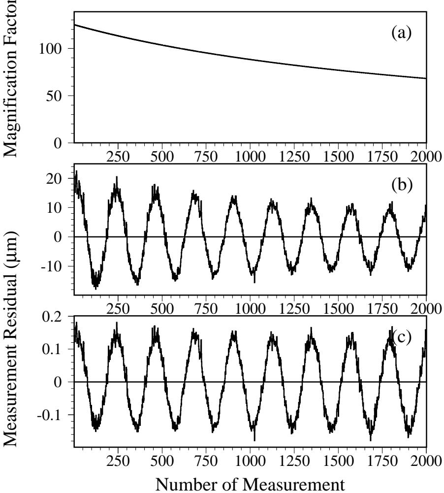  
Fig. 5. The frequency and amplitude of the controlled vibration source are 1 Hz and 140 nanometers, (a) Magnification factor versus number of distance measurements, (b) Distance measurement residual versus number of distance measurements, (c) Corrected measurement residual versus number of distance measurements.

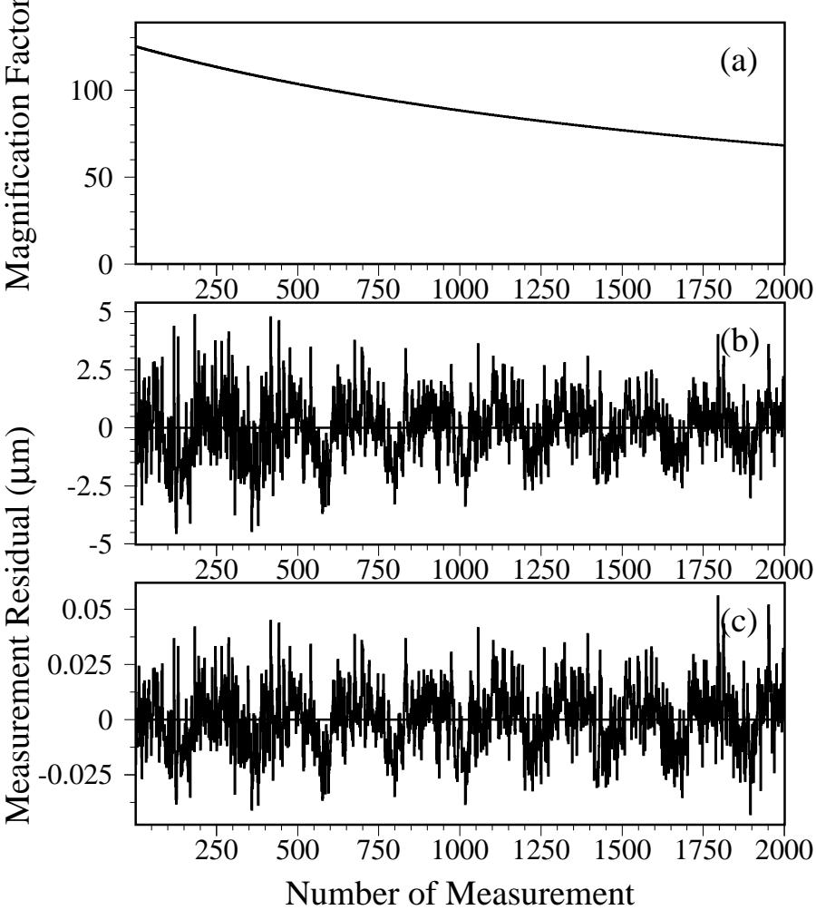  
Fig. 6. The frequency and amplitude of the controlled vibration source are 1 Hz and 9.5 nanometers, (a) Magnification factor versus number of distance measurements, (b) Distance measurement residual versus number of distance measurements, (c) Corrected measurement residual versus number of distance measurements.

tion frequencies and amplitudes using this technique are $f_{v i b}=1.025\pm0.002$ Hz, $A_{v i b}=9.3\pm0.3$ nanometers.

In addition, vibration frequencies at 0.1, 0.5, 1.0, 5, 10, 20, 50, 100 Hz with controlled vibration amplitudes ranging from 9.5 nanometers to 400 nanometers were studied extensively using our current FSI system. The measured vibrations and expected vibrations all agree well within the 10-15% level for amplitudes, 1-2% for frequencies, where we are limited by uncertainties in the expectations. Vibration frequencies far below 0.1 Hz can be regarded as slow fluctuations, which can not be suppressed by the above analysis techniques.

For comparison, nanometer vibration measurement by a self-aligned optical feedback vibrometry technique has been reported.10 The vibrometry technique is able to measure vibration frequencies ranging from 20 Hz to 20 kHz with minimal measurable vibration amplitude of 1 nm. Our second multiple-distance-measurement technique demonstrated above has capability to measure vibration frequencies ranging from 0.1 Hz to 100 Hz with minimal amplitude on the level of several nanometers, without a priori knowledge of the vibration strengths or frequencies.

# 7. Impact of Dispersion Effects on Distance Measurement

Dispersive elements such as a beamsplitter, corner cube prism, etc. in the interferometer can create an apparent offset in measured distance for an FSI system, since the optical path length of the dispersive element changes during the scan. The small OPD change caused by dispersion is magnified by a factor of Ω and has a significant effect on the absolute distance measurement for the FSI system. The measured optical path difference $L_{m e a s}$ may be expressed as

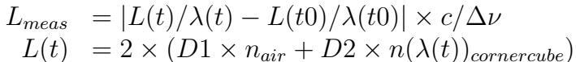

where $L(t)$ and $L(t0)$ refer to the OPD at times t and t0, respectively, λ(t) and $\lambda(t0)$ are the wavelength of the laser beam at times t and t0, c is the speed of light, D1 and D2 are true geometrical distances in the air and in the corner cube prism, $n_{a i r}$ and $n(\lambda(t))_{c o r n e r c u b e}$ are the refractive index of ambient atmosphere and the refractive index of the corner cube prism for $\lambda(t)$ , respectively. The measured distance $R_{\mathit{m e a s}}=L_{\mathit{m e a s}}/(2\bar{n}_{g})$ , where $\bar{n}_{g}$ is the average refractive index around the optical path.

The Sellmeier formula for dispersion in crown glass $(\mathrm{B K7})^{11}$ can be written $\mathrm{a s}$ ,

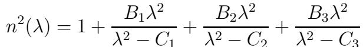

where, the beam wavelength λ is in unit of microns, $B_{1}=1.03961212,B_{2}=0.231792344$ , $B_{3}=1.01046945,C_{1}=0.00600069867,C_{2}=0.0200179144,C_{3}=103.560653$ .

If we use the first multiple-distance-measurement technique described above to make 2000 distance measurements for one typical scan, where the corner cube prism is used as retroreflector, we observe a highly reproducible drift in measured distance, as shown in Fig.7, where the fitted distance drift is $6.14\pm0.08$ microns for one typical scan using a straight line fit. However, there is no apparent drift if we replace the corner cube prism by the hollow retroreflector.

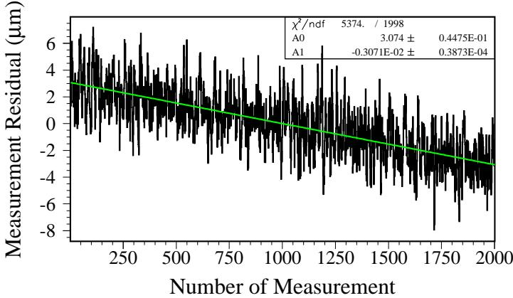  
Fig. 7. Residuals of 2000 distance measurements for one typical scan, the corner cube prism is used as retroreflector.

Numerical simulations have been carried out using $\mathrm{E q.(5)}$ and $\mathrm{E q.(6)}$ to understand the above phenomena. For instance, consider the case $\mathrm{D1}=20.97$ cm and D2 $=1.86$ cm (the uncertainty of D2 is 0.06 cm), where the first and the last measured distances among 2000 sequential distance measurements are denoted $R_{1}$ and $R_{2000}$ , respectively. Using the Sellmeier equation $(\mathrm{E q.}(6))$ for modeling the corner cube prism material (BK7) dispersion, we expect $R_{1}-\left(D1+D2\right)=373.876$ microns and $R_{2000}-\left(D1+D2\right)=367.707$ microns. The difference between $R_{1}$ and $R_{2000}$ is $6.2\pm0.2$ microns which agrees well with our observed $6.14\pm0.08$ microns drift over 2000 measured distances. The measured distance shift and drift strongly depend on D2, but are insensitive to D1. A change of 1 cm in D1 leads to a 3-nanometer distance shift, but the same change in D2 leads to a 200-micron distance shift. If a beamsplitter is oriented with its reflecting side facing the laser beam, then there is an additional dispersive distance shift. We have verified this effect with 1-mm and a 5-mm beam splitters. When we insert an additional beamsplitter with 1 mm thickness between the retroreflector and the original beamsplitter in the optical fiber FSI system, we observe a 500 microns shift on measured distance if $\bar{n}_{g}$ is fixed consistent with the numerical simulation result. For the 5-mm beam splitter (the measured thickness of the beam splitter is $4.6\pm0.05\mathrm{m m)}$ , the first 20 scans were performed with the beamsplitter’s anti-reflecting surface facing the optical fibers and the second 20 scans with the reflecting surface facing the optical fibers. The expected drifts $(R_{2000}-R_{1})$ for the first and the second 20 scans from the dispersion effect are 0 and $-1.53\pm0.05$ microns, respectively. The measured drifts by averaging measurements from 20 sequential scans are $-0.003\pm0.12$ microns and $-1.35\pm0.17$ microns, respectively. The measured values agree well with expectations. In addition, the dispersion effect from $\mathrm{a i r^{12,13}}$ is also estimated by using numerical simulation. The expected drift $(R_{2000}-R_{1})$ from air dispersion is approximately -0.07 microns for an optical path of 50 cm in air, this effect cannot be detected for our current FSI system. However, it could be verified by using a FSI with a vacuum tube surrounding the laser beam; the measured distance with air in the tube would be approximately 4 microns larger than for an evacuated tube.

In summary, dispersion effects can have a significant impact on absolute distance measurements, but can be minimized with care for elements placed in the interferometer or corrected for, once any necessary dispersive elements in the interferometer are understood.

# 8. Error Estimations

Some major error sources are estimated in the following;

1) Error from uncertainties of fringe and scanned frequency determination. The measurement precision of the distance R (the error due to the air’s refractive index uncertainty is considered separately below) is given by $(\sigma_{R}/R)^{2}\:=\:(\sigma_{\Delta N}/\Delta N)^{2}\:+\:$ $(\sigma_{\Delta\nu}/\Delta\nu)^{2}$ . where $R,\Delta N,\Delta\nu,\sigma_{R},\sigma_{\Delta N},\sigma_{\Delta\nu}$ are measurement distance, fringe numbers, scanned frequency and their corresponding errors. For a typical scanning rate of 0.5 nm/s with a 10 nm scan range, the full scan time is 20 seconds. The total number of samples for one scan is 2.5 MS at a sampling rate of 125 kS/s. There is about a $4{\sim}5$ sample ambiguity in fringe peak and valley position due to a vanishing slope and the limitation of the 12-bit sampling precision. However, there is a much smaller uncertainty for the F-P peaks because of their sharpness. Thus, the estimated uncertainty is $\sigma_{R}/R\sim1.9$ ppm for one full scan for a magnification factor $\Omega=67$ . If the number of distance measurements $N_{\mathit{m e a s}}=1200$ , the distance measurement window is smaller, the corresponding magnification factor is $\Omega^{*}=\nu/\Delta\nu$ , where, ν is $\Omega^{*}\sim94,\sigma_{R}/R\sim1.9~p p m\times\Omega^{*}/\Omega/\sqrt{N_{m e a s}}\sim77~p p b$ the average frequency of the laser beam,∗ ∗ √ $\Delta\nu=(4402-N_{m e a s})\times1.5$ . GHz. One obtains

2) Error from vibrations. The detected amplitude and frequency for vibration (without controlled vibration source) are about 0.3 µm and 3.2 Hz. The corresponding time for $N_{m e a s}\:=\:1200$ sequential distance measurements is 5.3 seconds. A rough estimation of the resulting error gives $\sigma_{R}/R\sim0.3\:\mu{m}/(5.3\:{s}{\times}3.2\:{H z}{\times}4)/R\sim10$ ppb for a given measured distance $R=0$ .45 meters.

3) Error from thermal drift. The refractive index of air depends on air temperature, humidity and pressure (fluctuations of humidity and pressure have negligible effects on distance measurements for the 20-second scan). Temperature fluctuations are well controlled down to about 0.5 mK(RMS) in our laboratory by the plastic box on the optical table and the pipe shielding the volume of air near the laser beam. For a room temperature of $\mathrm{~21~}^{\mathrm{~0~}}C$ , an air temperature change of 1 K will result in a 0.9 ppm change of air refractive index. For a temperature variation of $0.5~m K$ in the pipe, $N_{\mathit{m e a s}}=1200$ distance measurements, the estimated error will be $\sigma_{R}/R\sim0.9~p p m/K\times0.5~m K\times\Omega^{*}\sim42~p p b$ , where the magnification factor $\Omega^{*}=94$ .

The total error from the above sources, when added in quadrature, is ∼ 89 $p p b$ , with the major error sources arising from the uncertainty of fringe determination and the thermal drift. The estimated relative error agrees well with measured relative spreads of 91 ppb in real data for measured distance of about 0.45 meters.

Besides the above error sources, other sources can contribute to systematic bias in the absolute differential distance measurement. The major systematic bias comes from the uncertainty in the FSR of the F-P used to determine the scanned frequency range. The relative error would be $\sigma_{R}/R\sim50~p p b$ if the FSR were calibrated by a wavemeter with a precision of 50 ppb. A wavemeter of this precision was not available for the measurements described here. The systematic bias from the multipledistance-measurement technique was also estimated by changing the starting point of the measurement window, the window size and the number of measurements, the uncertainties typically range from 10 to 50 nanometers. Systematic bias from uncertainties in temperature, air humidity and barometric pressure scales are estimated to be negligible.

# 9. Conclusion

An optical fiber FSI system was constructed to make high-precision absolute distance and vibration measurements. A design of the optical fiber with GRIN lens was presented which improves the geometrical efficiency significantly. Two new multipledistance-measurement analysis techniques were presented to improve distance precision and to extract the amplitude and frequency of vibrations. Absolute distance measurement precisions of approximately 50 nm for distances ranging from 10 cm to 70 cm under laboratory conditions were achieved using the first analysis technique. The second analysis technique measures vibration frequencies ranging from 0.1 Hz to 100 Hz with minimal amplitude of a few nanometers. We verified an expected dispersion effect and confirmed its importance when dispersive elements are placed in the interferometer. Major error sources were estimated, and the observed errors were found to be in good agreement with expectation.

This work is supported by the National Science Foundation and the Department of Energy of the United States.

∗ Corresponding author, e-mail address: yhj@umich.edu

References   
1. A.F. Fox-Murphy, D.F. Howell, R.B. Nickerson, A.R. Weidberg, “Frequency scanned interferometry(FSI): the basis of a survey system for ATLAS using fast automated remote interferometry”, Nucl. Inst. Meth. A383, 229-237(1996)   
2. American Linear Collider Working Group(161 authors), “Linear Collider Physics, Resource Book for Snowmass 2001”, Prepared for the Department of Energy under contract number DE-AC03-76SF00515 by Stanford Linear Collider Center, Stanford University, Stanford, California. hep-ex/0106058, SLAC-R-570 299- 423(2001)   
3. J.A. Stone, A. Stejskal, L. Howard, “Absolute interferometry with a 670-nm external cavity diode laser”, Appl. Opt. Vol. 38, No. 28, 5981-5994(1999)   
4. Dai Xiaoli and Seta Katuo, “High-accuracy absolute distance measurement by means of wavelength scanning heterodyne interferometry”, Meas. Sci. Technol.9, 1031-1035(1998)   
5. G.P. Barwood, P. Gill, W.R.C. Rowley, “High-accuracy length metrology using multiple-stage swept-frequency interferometry with laser diodes”, Meas. Sci. Technol. 9, 1036-1041(1998)   
6. K.H. Bechstein and W Fuchs, “Absolute interferometric distance measurements applying a variable synthetic wavelength”, J. Opt. 29, 179-182(1998)   
7. J. Thiel, T. Pfeifer and M. Haetmann, “Interferometric measurement of absolute distances of up to 40m”, Measurement 16, 1-6(1995)   
8. H. Kikuta, R. Nagata, “Distance measurement by wavelength shift of laser diode light”, Appl. Opt. Vol. 25, 976-980(1986)   
9. P. A. Coe, “An Investigation of Frequency Scanning Interferometry for the alignment of the ATLAS semiconductor tracker”, Doctoral Thesis, St. Peter’s College, University of Oxford, Keble Road, Oxford, United Kingdom, 1-238(2001)   
10. K. Otsuka, K. Abe, J.Y. Ko, T.S. Lim, “Real-time nanometer-vibration measurement with a self-mixing microchip solid-state laser”, Opt. Lett. Vol. 27, 1339- 1341(2002)   
11. SCHOTT’96 for Windows Catalog Optical Glass, Schott Glaswerke Mainz, Germany, 1996, http://us.schott.com/sgt/english/products/catalogs.html   
12. E. R. Peck, K. Reeder, “Dispersion of air”, JOSA 62, 958-962 (1972)   
13. P.E. Ciddor, “Refractive index of air: new equations for the visible and near infrared”, Appl. Opt. Vol. 35, 1566-1573 (1996)