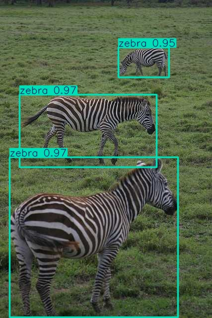
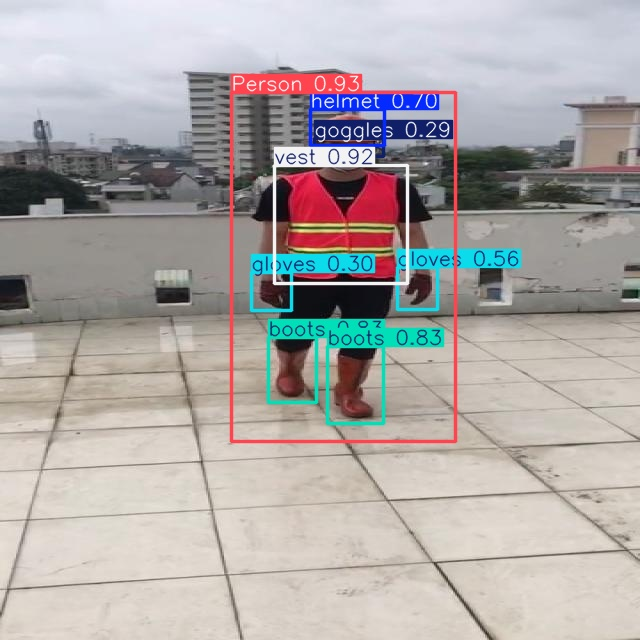
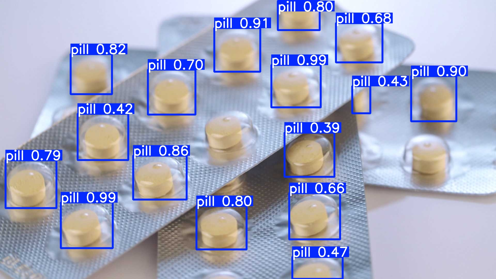

# dx-agentic-dev Showcases

> AI 코딩 에이전트가 **자연어 프롬프트 하나**로 **DEEPX NPU SDK** 위에 만든 실제 앱들 —
> 각 showcase에 프롬프트, 실측 결과, 한 줄 재현, 전체 빌드 세션 transcript가 함께 체크인되어 있습니다.

이들은 **dx-agentic-dev (Beta)**를 보여줍니다: 앱/태스크를 자연어로 설명하면 에이전트가 DEEPX
지식 베이스를 end-to-end로 구동(brainstorm → plan → TDD → verify)합니다. 기능 자체와 동작
방식 → [Agentic Development 문서](../docs/source/00_Agentic_Development_kor.md). 아래 각 카드는
해당 showcase의 README(상세 + transcript)로 연결됩니다.

<!-- catalog -->
<!-- dx-showcase:docs:catalog:start -->
## NPU 활용 AI 앱 (미니게임)

**단 20분, 약 $10의 비용으로, 자연어를 통해 DEEPX NPU용 앱을 완전 자율형으로 만드세요.** 프롬프트 하나로 만든 포즈 기반 미니게임 + 아케이드 HUD.

| Showcase | 유형 | 핵심 결과 |
|---|---|---|
| [스쿼트 카운팅 미니게임](./squat-fitness-mini-game/README-ko.md) | 게임 | 포즈 게임 + 아케이드 HUD |
| [스트레칭 coach 미니게임](./stretching-coach-mini-game/README-ko.md) | 게임 | coach 아바타 + 3단계 |

### 스쿼트 카운팅 미니게임

<a href="./squat-fitness-mini-game/README-ko.md"></a>

무릎/엉덩이 각도로 스쿼트 횟수 카운트 + 아케이드 HUD(횟수 / 점수 / DOWN·UP·GOOD!).

**핵심:** 포즈 게임 + 아케이드 HUD · **Claude Opus 4.8** · ≈ 20 min · ≈ $9.9 — [상세 →](./squat-fitness-mini-game/README-ko.md)

<br clear="right">

### 스트레칭 coach 미니게임

<a href="./stretching-coach-mini-game/README-ko.md"></a>

애니메이션 coach 아바타가 각 목표 포즈를 시연하며 3가지 스트레칭 안내.

**핵심:** coach 아바타 + 3단계 · **Claude Opus 4.8** · ≈ 21 min · ≈ $9.4 — [상세 →](./stretching-coach-mini-game/README-ko.md)

<br clear="right">

## Ultralytics 생태계 통합

**Ultralytics YOLO를 한 줄로 DEEPX NPU에 올리거나, 도메인에 맞게 재학습하세요 — 모두 자연어로.** `format=deepx` export + 4-way 평가(base/재학습 × fp32-GPU / INT8-NPU); INT8 ≈ fp32, 도메인 모델은 NPU에서 더 빠릅니다.

| Showcase | 유형 | 핵심 결과 |
|---|---|---|
| [Ultralytics YOLO → DeepX Export](./ultralytics-yolo-deepx-export/README-ko.md) | export | 1-cmd .pt → .dxnn |
| [아프리카 야생동물 모니터링](./ultralytics-retrain-eval-deepx-export-wildlife/README-ko.md) | 재학습 | mAP ~0.0007→0.79, 59→80 FPS |
| [건설 PPE 안전](./ultralytics-retrain-eval-deepx-export-ppe/README-ko.md) | 재학습 | mAP 0.0001→0.257, 58→80 FPS |
| [뇌종양 스크리닝](./ultralytics-retrain-eval-deepx-export-braintumor/README-ko.md) | 재학습 | mAP ~0.0005→0.40, 59→83 FPS |
| [의약품 알약 검사](./ultralytics-retrain-eval-deepx-export-pills/README-ko.md) | 재학습 | mAP ~0.001→0.75 (mAP50 0.97), 55→78 FPS |

### Ultralytics YOLO → DeepX Export

<a href="./ultralytics-yolo-deepx-export/README-ko.md"><video height="170" autoplay muted loop playsinline poster="../docs/source/img/dx-agentic-dev-ultralytics-yolo-poster.jpg" align="right"><source src="../docs/source/img/dx-agentic-dev-ultralytics-yolo.mp4" type="video/mp4"></video></a>

Ultralytics YOLO `.pt`를 단일 `yolo export ... format=deepx` 명령으로 배포 가능한 DeepX NPU 모델(`.dxnn`)로 변환, NPU 추론 + verify.

**핵심:** 1-cmd .pt → .dxnn · **Claude Sonnet 4.6** · ≈ 11.6 min · ≈ $2.4 — [상세 →](./ultralytics-yolo-deepx-export/README-ko.md)

<br clear="right">

### 아프리카 야생동물 모니터링

<a href="./ultralytics-retrain-eval-deepx-export-wildlife/README-ko.md"></a>

사파리/보전 카메라용으로 `yolo26n`을 `african-wildlife`(buffalo/elephant/rhino/zebra)로 재학습; base/재학습 × fp32/INT8 4-way 평가.

**핵심:** mAP ~0.0007→0.79, 59→80 FPS · **Claude Opus 4.8** · ≈ 12 min · ≈ $3.3 — [상세 →](./ultralytics-retrain-eval-deepx-export-wildlife/README-ko.md)

<br clear="right">

### 건설 PPE 안전

<a href="./ultralytics-retrain-eval-deepx-export-ppe/README-ko.md"></a>

현장 안전 카메라용으로 `yolo26n`을 `construction-ppe`(helmet/vest/...)로 재학습; base/재학습 × fp32/INT8 4-way 평가.

**핵심:** mAP 0.0001→0.257, 58→80 FPS · **Claude Opus 4.8** · ≈ 13 min · ≈ $5.1 — [상세 →](./ultralytics-retrain-eval-deepx-export-ppe/README-ko.md)

<br clear="right">

### 뇌종양 스크리닝

<a href="./ultralytics-retrain-eval-deepx-export-braintumor/README-ko.md"></a>

의료 edge 디바이스용으로 `yolo26n`을 `brain-tumor`(MRI/CT)로 재학습; base/재학습 × fp32/INT8 4-way 평가.

**핵심:** mAP ~0.0005→0.40, 59→83 FPS · **Claude Opus 4.8** · ≈ 12 min · ≈ $3.7 — [상세 →](./ultralytics-retrain-eval-deepx-export-braintumor/README-ko.md)

<br clear="right">

### 의약품 알약 검사

<a href="./ultralytics-retrain-eval-deepx-export-pills/README-ko.md"></a>

제약 카운팅 스테이션용으로 `yolo26n`을 `medical-pills`로 재학습; base/재학습 × fp32/INT8 4-way 평가.

**핵심:** mAP ~0.001→0.75 (mAP50 0.97), 55→78 FPS · **Claude Opus 4.8** · ≈ 10 min · ≈ $5.1 — [상세 →](./ultralytics-retrain-eval-deepx-export-pills/README-ko.md)

<br clear="right">

## PaddlePaddle 생태계 통합

PaddlePaddle/PaddleOCR 모델의 DEEPX NPU 통합.

> _추후 추가 예정._
<!-- dx-showcase:docs:catalog:end -->

## showcase 재현

```bash
cd dx-agentic-dev-showcase/<showcase>
bash setup.sh && bash run.sh        # 재학습/export showcase
# 게임: ./setup.sh 후 ./run.sh (또는 ./run.sh --camera 0)
```

x86-64 Linux + DeepX runtime(`dx_engine`) 필요. showcase별 사전 요구사항과 정확한 프롬프트는
각 showcase README에 있습니다.

> English: [`README.md`](./README.md).
